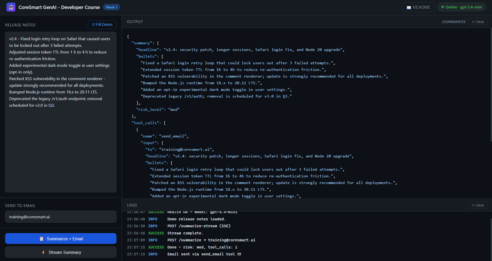

# ReleaseBot - Week 1

**CoreSmart GenAI Developer Course · Week 1**

ReleaseBot takes raw engineering release notes, summarises them with an LLM, and emails the summary to your team. It demonstrates the three patterns used in almost every production LLM app:

| Pattern | Endpoint | File |
|---|---|---|
| **Streaming** | `POST /summarize-stream` | `app/llm.py` → `stream_text` |
| **Structured output** | `POST /summarize` | `app/schemas.py` + `app/tools.py` |
| **Tool call** | `POST /summarize` | `app/tools.py` + `app/llm.py` |

---

## Project layout

```
/
├── app/
│   ├── __init__.py
│   ├── config.py            ← typed settings + .env loader
│   ├── schemas.py           ← Pydantic models (ReleaseSummary, SummaryRequest)
│   ├── tools.py             ← send_email tool schema + Gmail SMTP implementation
│   ├── llm.py               ← OpenAI SDK wrapper (streaming + single-call tool use)
│   └── main.py              ← FastAPI routes + CORS + /readme
├── tests/
│   └── test_endpoint.py       ← smoke tests (no real API calls)
├── index.html                 ← browser UI (open via http://localhost:8000)
├── WebUI.png                  ← screenshot of the running UI
├── week1_notebook.ipynb       ← exercise every endpoint on your own machine (Python + curl reference)
├── releasebot_colab.ipynb     ← run the whole app in Google Colab (no local install)
├── tool_call_single_round_trip.svg   ← single round-trip tool-call flow
├── streaming_sequence.svg     ← SSE streaming end-to-end
├── requirements.txt
├── .env.example               ← copy to .env and fill in
├── .gitignore
└── README.md                  ← you are here
```

---

## 1. What this app does

- Streams an LLM response token-by-token over **Server-Sent Events** → `POST /summarize-stream`
- Sends a **structured, typed** release summary email via a **single tool-call round-trip** → `POST /summarize`
- Serves a **browser UI** at `GET /` - no separate server needed
- Renders the README as HTML at `GET /readme`


---

## 2. Setup (5 min)

> Requirements: Python 3.10+, an OpenAI API key, a Gmail account with 2-Step Verification enabled.

```bash
# 1. Create and activate a venv
python -m venv .venv
source .venv/bin/activate          # Windows: .venv\Scripts\activate

# 2. Install dependencies
pip install -r requirements.txt

# 3. Copy env file and fill in real values
cp .env.example .env
# Open .env and set: OPENAI_API_KEY, SMTP_SENDER, SMTP_PASSWORD

# 4. Start the server
uvicorn app.main:app --reload
```

**You're live at `http://localhost:8000`.**

- Browser UI: `http://localhost:8000`
- Swagger docs: `http://localhost:8000/docs`
- README: `http://localhost:8000/readme`

> **Gmail App Password:** go to [myaccount.google.com/apppasswords](https://myaccount.google.com/apppasswords), create an app password, paste the 16-character code into `SMTP_PASSWORD`. The recipient email is entered at request time (in the UI or in the JSON body) - not stored in `.env`.

### Prefer not to install anything? Run it in Google Colab

Open **`releasebot_colab.ipynb`** in [Google Colab](https://colab.research.google.com/) and run the cells top to bottom. It runs the exact same app, and it:

- reads your `OPENAI_API_KEY`, `SMTP_SENDER`, and `SMTP_PASSWORD` from Colab's built-in **Secrets** vault (the key icon), so no secret is ever typed into a cell,
- installs the dependencies and starts the server in the background for you,
- opens the browser UI through **Colab's own port proxy**, scoped to your session.

We deliberately do not expose the app through a public third-party tunnel: ReleaseBot sends real email through your Gmail, and a public URL would let anyone who saw it trigger a send. The own-machine path is still the one the walkthrough video follows and the one to use for the graded project.

---

## 3. File-by-file walkthrough

### `app/config.py` - Settings

All environment variables live in one typed `Settings` class (powered by `pydantic-settings`).

```python
settings = get_settings()
print(settings.openai_model)   # gpt-5.4-mini-2026-03-17 (override with OPENAI_MODEL in .env)
```

Two reasons to centralise config here:
1. Reading `os.environ["KEY"]` from random places is how secrets end up in logs.
2. `pydantic-settings` validates types on startup - a missing key fails loudly **before** the first request, not mid-flight.

The `@lru_cache` on `get_settings()` means `.env` is read exactly once.

---

### `app/schemas.py` - Structured output contract

`ReleaseSummary` defines what the model must produce:

```python
class ReleaseSummary(BaseModel):
    headline:   str          # 1–120 chars
    bullets:    list[str]    # 2–6 items
    risk_level: RiskLevel    # "low" | "med" | "high"  - Literal type, enforced
```

`SummaryRequest` is the incoming request schema (`release_notes`, optional `recipient` override).

**Schema-first prompting habit:** define the shape first, then build the prompt around it. Pydantic validates every response - invalid model output becomes a clean **502** (422 is reserved for request-side validation, like empty `release_notes`), never silent garbage downstream.

---

### `app/tools.py` - Tool definition + Gmail SMTP

**Key design choice:** `send_email` takes `headline`, `bullets`, and `risk_level` as structured parameters - not a free-text `body`. This means the tool call arguments **are** the structured output. No text parsing needed.

```python
TOOL_SCHEMAS = [{
    "type": "function",
    "function": {
        "name": "send_email",
        "strict": True,                   # API constrains generation to this schema
        "parameters": {
            "to":         str,            # recipient
            "headline":   str,            # one-line summary
            "bullets":    list[str],      # key changes
            "risk_level": "low"|"med"|"high",   # enum - enforced by strict mode
            # all properties required · additionalProperties: false
        }
    }
}]
```

With `strict: true`, the API constrains argument generation to the schema - guaranteed parseable JSON, guaranteed shape and enum. Length and item-count limits (`maxLength`, `minItems`, …) aren't supported by strict mode, so the Pydantic `ReleaseSummary` model enforces the 120-char headline and 2-6 bullets at the boundary.

The `execute_tool` dispatcher looks up `send_email` by name, calls it, and returns `{"success": true, ...}` or `{"success": false, "error": "..."}` - errors go back to the caller, never raise.

Two questions to ask of every tool you write:
- **Idempotency** - what happens if the model calls this twice?
- **Blast radius** - what's the worst outcome if the model fills in wrong values?

---

### `app/llm.py` - The LLM wrapper

Two public functions:

#### `stream_text(prompt)` → async generator of text deltas

Used by `/summarize-stream`. Calls `chat.completions.create(stream=True)` and yields each `chunk.choices[0].delta.content` as it arrives. The route wraps each delta in an SSE frame.

See **`streaming_sequence.svg`** for the end-to-end five-lane diagram.

#### `summarize_with_tools(release_notes, recipient)` → dict

**Single API call** - one round-trip, no second call.

```
App → Model:  prompt + tool schemas + tool_choice="send_email" (forced)
Model → App:  finish_reason="tool_calls"
              args = {to, headline, bullets, risk_level}   ← structured output
App:          execute send_email(args)  →  email sent
              build ReleaseSummary from args               ← no text parsing
              return {summary, tool_calls}
```

`tool_choice` forces the model to call `send_email` on every request. The arguments arrive as a **JSON string** (`tc.function.arguments`), so `llm.py` does one `json.loads` - and because the tool is marked `strict: true`, that parse always succeeds and the shape always matches the schema. No fence-stripping fallback, no second API call.

See **`tool_call_single_round_trip.svg`** for the 6-step diagram.

---

### `app/main.py` - FastAPI routes

| Route | Method | What it does |
|---|---|---|
| `/` | GET | Serve browser UI (`index.html`) |
| `/health` | GET | Liveness probe - returns model name |
| `/readme` | GET | Render README.md as HTML (marked.js) |
| `/summarize` | POST | Structured output + tool call |
| `/summarize-stream` | POST | Streaming SSE response |

CORS is open (`allow_origins=["*"]`) so the UI works from `file://` or any port during development.

---

### `index.html` - Browser UI

Open at `http://localhost:8000` after starting the server.



**Left panel:**
- Release notes textarea (grows to fill space)
- **↺ Fill Demo** button - loads a sample release note
- Recipient email input
- **📋 Summarize + Email** - calls `POST /summarize`, shows syntax-highlighted JSON
- **⚡ Stream Summary** - calls `POST /summarize-stream`, streams tokens live with a blinking cursor

**Right panel:**
- **Output** - JSON with colour-coded keys/strings/numbers; **{ } Format** button parses streamed text as JSON
- **Logs** - timestamped INFO / SUCCESS / WARN / ERROR entries per request

**Header:**
- Health chip - auto-checks on load, turns green/red, shows model name
- **📖 README** - opens `http://localhost:8000/readme` in a new tab

---

### `week1_notebook.ipynb` - API notebook (own machine)

A Jupyter notebook covering every endpoint. The **Python (`requests`) cells run on macOS, Linux, and Windows alike** and are the executable path; curl is shown as a copy-paste **reference** for your own terminal (no OS-specific cell magic).

| Section | curl (reference) | Python (`requests`) |
|---|---|---|
| Health check | ✓ | ✓ |
| Stream (`/summarize-stream`) | ✓ | ✓ (SSE, token-by-token) |
| Summarize + email (`/summarize`) | ✓ | ✓ |
| Raw response dump | - | ✓ |
| Failure: empty notes (422) | ✓ | ✓ |
| Failure: missing recipient (422) | ✓ | ✓ |
| Swagger UI link | - | ✓ |

### `releasebot_colab.ipynb` - Colab run path

Sets up and runs the whole app inside Google Colab: secrets from Colab's vault, background server, UI via Colab's own private port proxy, then the same endpoint exercises. See [section 2](#2-setup-5-min) for the Colab note.

---

## 4. Try it out

### a) Health check

```bash
curl http://localhost:8000/health
# {"status":"ok","model":"gpt-5.4-mini-2026-03-17"}
```

### b) Streaming summary

```bash
curl -N -X POST http://localhost:8000/summarize-stream \
  -H 'Content-Type: application/json' \
  -d '{"release_notes": "v2.4 - Fixed login retry on Safari. Extended TTL to 4h. Added dark mode."}'
```
> Windows `cmd`: replace the `\` line continuations with `^`, and escape the inner quotes as `\"`.

Watch `data: {"delta": "..."}` events arrive token-by-token.

### c) Structured summary + email

```bash
curl -X POST http://localhost:8000/summarize \
  -H 'Content-Type: application/json' \
  -d '{"release_notes": "v2.4 - Fixed login retry on Safari. Patched XSS. Bumped Node to 20 LTS.", "recipient": "you@example.com"}'
```
> Windows `cmd`: replace the `\` line continuations with `^`, and escape the inner quotes as `\"`.

Expected response:

```json
{
  "summary": {
    "headline": "v2.4 - auth fixes, XSS patch, Node 20 LTS",
    "bullets": [
      "Login retry loop on Safari is fixed",
      "XSS vulnerability in comment renderer patched",
      "Node.js runtime upgraded to 20.11 LTS"
    ],
    "risk_level": "med"
  },
  "tool_calls": [
    {
      "name": "send_email",
      "input": {
        "to": "you@example.com",
        "headline": "v2.4 - auth fixes, XSS patch, Node 20 LTS",
        "bullets": ["..."],
        "risk_level": "med"
      },
      "result": {"success": true, "to": "you@example.com", "subject": "Release Update: v2.4 ..."}
    }
  ]
}
```

The email arrives in the recipient's inbox with the formatted summary.

---

## 5. Diagrams

| File | What it shows |
|---|---|
| `tool_call_single_round_trip.svg` | 6-step single round-trip: forced tool call → structured args → email → response |
| `streaming_sequence.svg` | 5-lane SSE flow: Client → FastAPI → llm.py → SDK → OpenAI API |

The tool-call diagram reflects the current single-call design. The old two-round-trip pattern (send tool result back → get final text) has been intentionally replaced.

---

## 6. Common failure modes

### a) Email SMTP auth fails

`send_email` returns `{"success": false, "error": "..."}`. Check that `SMTP_SENDER` and `SMTP_PASSWORD` in `.env` are correct and that your Gmail App Password is still valid (they expire if 2FA is disabled).

### b) `finish_reason` is not `"tool_calls"`

Logged as a WARNING: `[summarize] tool not triggered`. This should not happen with `tool_choice` forced, but if the model is unavailable or the API returns an error, the route raises HTTP 502 with a clear message.

### c) Streaming disconnect

If the client closes the connection mid-stream, the async generator is garbage-collected and the SDK closes the upstream connection. The `except` block in `event_generator` emits a final `data: {"error": "..."}` frame instead of dropping silently.

---

## 7. Run the tests

```bash
pytest -q
```

Four smoke tests - no real API calls, no SMTP:

| Test | What it checks |
|---|---|
| `test_health_returns_ok` | `/health` returns 200 |
| `test_summarize_rejects_empty_notes` | empty `release_notes` → 422 |
| `test_release_summary_schema_round_trip` | `ReleaseSummary` validates correctly |
| `test_release_summary_rejects_bad_risk_level` | invalid enum → raises |

---

## 8. Where this goes next

The same codebase is extended each week:

- real retrieval layer (Postgres + embedding lookup)
- error handling, retries, structured logging
- evals and a prompt registry
- memory layer, multi-step tool use, observability, cost attribution

Don't throw this away - every week builds on it.
