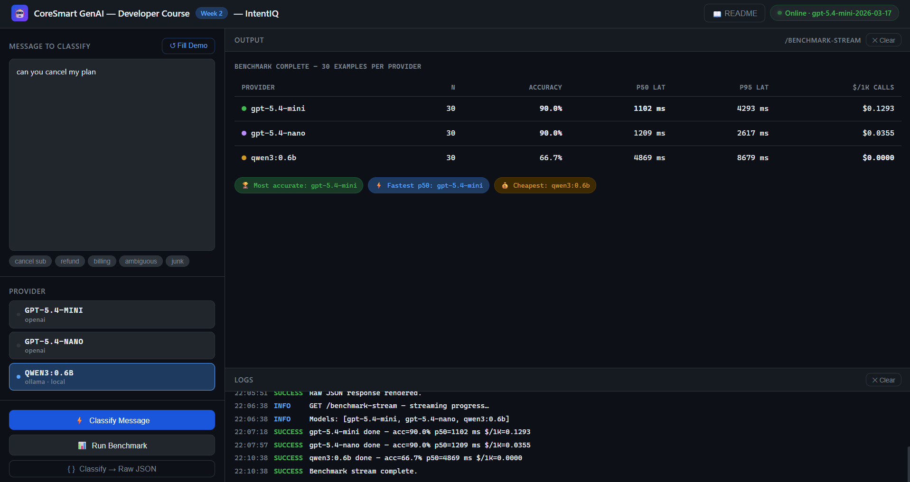

# IntentIQ - Week 2

**CoreSmart GenAI Developer Course · Week 2**

IntentIQ runs the same 30 hand-labelled user messages through three model tiers - gpt-5.4-mini, gpt-5.4-nano, and a local qwen3:0.6b on Ollama - and produces one comparison table. It demonstrates the three patterns used in every benchmark and routing system that comes later in the course: a provider abstraction, a hand-labelled golden dataset, and a multi-axis eval.

| Pattern | Endpoint / entry-point | File |
|---|---|---|
| **Provider abstraction** | `POST /classify` | `app/llm.py` |
| **Benchmark harness** | `python -m app.main benchmark` *or* `POST /benchmark` | `app/eval.py` |
| **Golden-set eval** | `golden_dataset.jsonl` (30 hand-labelled rows) | `app/eval.py::summarise` |

---

## Project layout

```
/
├── app/
│   ├── __init__.py
│   ├── config.py            ← typed settings + .env loader (model pins live here)
│   ├── schemas.py           ← Pydantic models (INTENT_LABELS, Provider, Result, GoldenExample, BenchmarkRow, BenchmarkSummary)
│   ├── llm.py               ← provider abstraction (3 adapters + shared _openai_call helper)
│   ├── eval.py              ← benchmark harness + per-provider aggregator
│   └── main.py              ← FastAPI routes + CLI runner + /readme
├── tests/
│   └── test_endpoint.py     ← smoke tests (no real API calls)
├── index.html               ← browser UI (open via http://localhost:8000)
├── week2_notebook.ipynb     ← curl + Python requests for every endpoint
├── golden_dataset.jsonl     ← 30 hand-labelled examples
├── results.csv              ← written by `benchmark`, one row per call
├── WebUI.png                ← screenshot used in this README
├── requirements.txt
├── .env.example             ← copy to .env and fill in
├── .gitignore
└── README.md                ← you are here
```

---

## 1. What this app does

- Single classify → `POST /classify` (one message, one provider, returns label + confidence + latency + tokens)
- Full benchmark → `POST /benchmark` *or* `python -m app.main benchmark` (30 examples × N configured providers → per-provider summary table)
- Reads the golden set from `golden_dataset.jsonl` - committed to the repo, hand-labelled by a human
- Writes per-example detail to `results.csv` after every run
- Serves a **browser UI** at `GET /` - no separate server needed
- Renders the README as HTML at `GET /readme`


---

## 2. Setup (5 min)

> Requirements: Python 3.10+, an OpenAI API key, and a local [Ollama](https://ollama.com/) install for the qwen3 provider.

```bash
# 1. Create and activate a venv
python -m venv .venv
source .venv/bin/activate          # Windows: .venv\Scripts\activate

# 2. Install dependencies
pip install -r requirements.txt

# 3. Copy env file and fill in real values
cp .env.example .env
# Open .env and set: OPENAI_API_KEY=sk-...

# 4. Start Ollama and pull the local model (separate terminal, leave running)
ollama serve
ollama pull qwen3:0.6b

# 5. Start the server
uvicorn app.main:app --reload
```

**You're live at `http://localhost:8000`.**

- Browser UI: `http://localhost:8000`
- Swagger docs: `http://localhost:8000/docs`
- README: `http://localhost:8000/readme`

> **Ollama setup quirk:** Ollama needs to be running locally for the qwen3 provider. If you skip step 4, the OpenAI providers still work - `run_benchmark` logs Ollama-row failures and finishes the OpenAI columns. Pre-warm qwen3 once (`POST /classify` with `provider: "ollama"`) before recording a benchmark, otherwise the first call is a 10-second cold model load that skews the qwen3 p50.

---

## 3. File-by-file walkthrough

### `app/config.py` - Settings

All environment variables live in one typed `Settings` class (powered by `pydantic-settings`).

```python
class Settings(BaseSettings):
    openai_api_key:  str | None = None
    openai_model:    str        = "gpt-5.4-mini-2026-03-17"
    nano_model:      str        = "gpt-5.4-nano-2026-03-17"
    ollama_base_url: str        = "http://localhost:11434/v1"
    ollama_model:    str        = "qwen3:0.6b"
```

Two reasons to centralise config here:
1. Reading `os.environ["KEY"]` from random places is how secrets end up in logs.
2. `pydantic-settings` validates types on startup, so a key with the wrong shape fails loudly **before** the first request, not mid-flight. (`openai_api_key` is `str | None = None` so the app boots without it; the OpenAI client itself raises a clean `AuthenticationError` on first call. Ollama-only runs work without any API key set.)

The `@lru_cache` on `get_settings()` means `.env` is read exactly once per process.

**Model-pinning lesson:** notice the OpenAI fields use **dated identifiers** - `gpt-5.4-mini-2026-03-17`, not the alias `gpt-5.4-mini`. The alias would let OpenAI silently swap the underlying weights when they ship the next minor release, and your eval numbers would drift without warning. The dated pin freezes the model under the benchmark. When you want to evaluate a newer release, you update one string here and re-run the golden set against both pins - that's how you turn a model upgrade into a measurement, not a surprise.

---

### `app/schemas.py` - Shared data contracts

Every other module speaks this language. Seven exports:

```python
INTENT_LABELS = ("cancel_subscription", "request_refund", "payment_question", "unknown")
Provider = Literal["openai", "nano", "ollama"]

class Result(BaseModel):
    provider:      Provider
    label:         str
    confidence:    float = Field(ge=0.0, le=1.0)   # enforced at runtime
    latency_ms:    float
    input_tokens:  int
    output_tokens: int
    raw:           dict = {}

class ClassifyRequest(BaseModel):
    text:     str
    provider: Provider = "openai"      # default to the larger hosted tier
```

- `INTENT_LABELS` is the single source of truth for what a valid label string is. The system prompt, the golden dataset, and `normalise_label()` all reference it.
- `Provider` is a 3-key `Literal` - invalid provider names in incoming requests fail Pydantic validation with a clean 422, never reach the LLM layer.
- `Result` is the unified return shape every adapter produces. The `ge=0.0`/`le=1.0` constraint on confidence is enforced at runtime - a hallucinated `confidence=1.5` from a small model raises a validation error rather than silently corrupting the downstream metric.
- `ClassifyRequest` is the inbound shape for `POST /classify` - one message + one provider. The `provider: Provider = "openai"` default means a request body of `{"text": "..."}` alone routes to `gpt-5.4-mini`. Explicit > implicit when you want to compare tiers.
- `GoldenExample`, `BenchmarkRow`, `BenchmarkSummary` are the primitives of the measurement loop - one JSONL row in, one per-example row to `results.csv`, one row per provider in the headline table.

**Schema-first habit:** define the shape first, then build the prompt and harness around it.

---

### `app/llm.py` - Provider abstraction (3 adapters + shared helper)

This is the heart of IntentIQ. Sixty percent of the interesting logic lives here.

```python
def classify(provider: Provider, text: str) -> Result:
    return _DISPATCH[provider](text)
```

- **`_openai_call(text, provider, model)`** - the shared helper. Two providers (`openai`, `nano`) hit the same SDK with the same API key - only the model string differs, so the call shape is extracted *once*. Adds rate-limit retry (one attempt, 0.5s sleep *inside* the latency timer so the reported number is honest) and re-raises any other HTTP error as a readable `RuntimeError`.
- **`openai_classify` / `nano_classify`** - three-line wrappers around the helper. Adding a third OpenAI tier later is a seven-line change, not a new module.
- **`ollama_classify`** - uses the **same OpenAI SDK** pointed at `localhost:11434/v1`. Ollama exposes an OpenAI-compatible API, so the call shape is identical for all three providers - only the client config differs. One library, three backends.
- qwen3:0.6b is a *reasoning* model, so the Ollama adapter has three layers of defence against thinking-mode token exhaustion: `extra_body={"think": False}` → `max_tokens=400` → fallback to `message.model_extra["reasoning"]` if `message.content` is empty.
- `normalise_label()` lowercases, strips, maps unknown labels to `"unknown"` - without this, `'Cancel_Subscription'` from a small model would never equal `'cancel_subscription'` and your accuracy would silently show zero.
- `_safe_json()` is a three-stage parser: strict JSON → fenced code block → bare `{...}` → empty dict. Small or local models often wrap JSON in prose; this catches every shape we've seen in practice.

See **`intentiq_architecture.svg`** for the abstraction diagram and **`schema_drift.svg`** for the response-shape contrast across the three adapters.

---

### `app/eval.py` - Benchmark harness + aggregator

The measurement engine. Five functions, walk them in call order:

- **`load_golden(path)`** - reads `golden_dataset.jsonl` one line at a time, returns `list[GoldenExample]`.
- **`run_one(provider, example)`** - calls `classify`, builds a `BenchmarkRow`. The `correct` field is a single boolean: `predicted_label == expected_label`.
- **`run_benchmark(golden, providers)`** - outer loop; catches per-row exceptions (rate-limit-not-recovered, connection error, JSON parse failure) and logs failed rows with `predicted="unknown"`, `correct=False`, `latency_ms=0`. **Production benchmarks do not crash on a single bad call.**
- **`summarise(rows)`** - groups by provider, computes `accuracy`, `p50_ms` (median via `statistics.median`), `p95_ms` (via `statistics.quantiles(..., n=20)[-1]`), and `cost_per_1k_usd` from the `_PRICING` table at the top of the file.
- **`write_csv(rows, path)`** - dumps every per-call `BenchmarkRow` to `results.csv` (columns derived from the model fields), so any number in the summary table can be audited row by row.

Current pricing table (update when provider pricing changes):

| Provider | $/1M input | $/1M output |
|---|---|---|
| `openai` (gpt-5.4-mini) | $0.75 | $4.50 |
| `nano` (gpt-5.4-nano) | $0.20 | $1.25 |
| `ollama` (qwen3:0.6b) | $0.00 | $0.00 |

> **Limitation:** the aggregator does **not** split warm vs cold latencies (`cold_start_ms=None` always). A cold first qwen3 call (10–15s while the model loads) will skew the qwen3 p50. Pre-warm with one `/classify` call before running the benchmark.

See **`benchmark_harness_flow.svg`** for the loop diagram.

---

### `app/main.py` - FastAPI routes + CLI runner

| Route | Method | What it does |
|---|---|---|
| `/` | GET | Serve browser UI (`index.html`) |
| `/health` | GET | Liveness probe - status, all three model pins, configured providers |
| `/readme` | GET | Render `README.md` as HTML (Python `markdown` package, server-side) |
| `/classify` | POST | One message → one provider → `Result` |
| `/benchmark` | POST | Full golden-set run → list of `BenchmarkSummary` (sync - CLI / notebook / curl) |
| `/benchmark-stream` | GET | Same run streamed as Server-Sent Events - used by the Web UI for live progress |
| `/debug/providers` | GET | Dev-only connectivity smoke-test for all three providers |
| `python -m app.main benchmark` | CLI | Same as `POST /benchmark` but prints the comparison table to stdout, no HTTP server |

There is no CORS middleware - none is needed. The UI is served **same-origin** from `GET /`, so its `fetch` calls to `localhost:8000` are first-party. If you ever host the frontend on a different origin, that's when you'd add `CORSMiddleware` with a narrow allow-list.

`_print_summary` formats the CLI comparison table. The separator is ASCII `-` (not Unicode `─`) so it renders correctly on Windows consoles.

---

### `index.html` - Browser UI

Open at `http://localhost:8000` after starting the server.



**Left panel:**
- Message textbox with demo pills (one click loads a sample message per intent label)
- Provider selector (cards for OpenAI / OpenAI nano / Ollama local)
- **Classify** button - calls `POST /classify` with the selected provider, renders a result card with label / confidence / latency / token counts
- **Run Benchmark** button - calls `GET /benchmark-stream` (SSE) and streams live per-provider progress; when done, renders the headline comparison table with the best-accuracy, best-p50 and best-cost cells highlighted plus three winner chips (🏆 Most accurate · ⚡ Fastest p50 · 💰 Cheapest)

**Right panel:**
- **Output** pane - where classify cards, streaming progress and the final benchmark table render
- **Logs** pane - timestamped request log for every call the UI makes

**Header:**
- Health chip - auto-checks on load, turns green/red, shows the OpenAI model pin
- **📖 README** - opens `http://localhost:8000/readme` in a new tab


---

### `week2_notebook.ipynb` - API notebook

A Jupyter notebook covering every endpoint two ways:

| Section | curl (`%%cmd`, Windows) | Python (`requests`) |
|---|---|---|
| Health check | ✓ | ✓ |
| Single `/classify` (each provider) | ✓ | ✓ |
| All-providers comparison loop | - | ✓ |
| Full raw response dump | - | ✓ |
| Full `/benchmark` | ✓ | ✓ |
| Streaming `/benchmark-stream` (SSE) | ✓ | ✓ |
| CLI `python -m app.main benchmark` | ✓ | - |
| Failure: invalid provider (422) | ✓ | ✓ |
| Failure: provider key not configured (400) | ✓ | ✓ |
| Swagger UI link | - | ✓ |

All `%%cmd` cells use Windows double-quote syntax - single quotes cause errors in `cmd.exe`. Use `%%bash` for Linux or macOS.

---

## 4. Try it out

### a) Health check

```bash
curl http://localhost:8000/health
# {"status":"ok",
#  "model":"gpt-5.4-mini-2026-03-17",
#  "openai_model":"gpt-5.4-mini-2026-03-17",
#  "nano_model":"gpt-5.4-nano-2026-03-17",
#  "ollama_model":"qwen3:0.6b",
#  "ollama_base_url":"http://localhost:11434/v1",
#  "providers_configured":["openai","nano","ollama"]}
```

### b) Classify a single message

```bash
curl -X POST http://localhost:8000/classify ^
  -H "Content-Type: application/json" ^
  -d "{\"text\":\"can you cancel my plan\",\"provider\":\"openai\"}"
```

Try `"provider":"nano"` or `"provider":"ollama"` to see the same input scored by a different tier. Compare the returned `latency_ms` - that's the per-call experience.

### c) Run the full benchmark from the CLI

```bash
python -m app.main benchmark
```

Expected output (numbers will vary across runs):

```
provider      n     acc       p50       p95      $/1K
-----------------------------------------------------
openai       30    90.0%     960ms    4665ms   0.1293
nano         30    93.3%     974ms    1185ms   0.0354
ollama       30    66.7%    6510ms   13071ms   0.0000
```

The row layout mirrors `app/main.py::_print_summary`: `{provider:<11}{n:>4}{acc:>7.1f}%{p50:>9.0f}ms{p95:>9.0f}ms{$/1K:>9.4f}`, separator `'-' * 53`. `results.csv` is written alongside the JSONL with one row per call.

Pre-warm Ollama with one `/classify` call before this command, otherwise the first qwen3 call is a cold model load that skews the qwen3 p50.

---

## 5. Diagrams

| File | What it shows |
|---|---|
| `intentiq_architecture.svg` | Provider abstraction → 3 backends; golden dataset feeding the harness |
| `benchmark_harness_flow.svg` | Golden example → fan-out to 3 providers → per-provider result rows → aggregator → comparison table |
| `results_table.svg` | The headline comparison table + 3 trade-off cards (accuracy+tail+cost wins nano · median speed wins mini · free+private wins qwen3) |
| `schema_drift.svg` | One prompt, three response shapes (clean JSON · case + type drift · prose + fenced JSON); how the adapters normalise to one `Result` |


---

## 6. Common failure modes

### a) `RateLimitError` (429) on the OpenAI providers

**Trigger:** iterating too fast on a free / low-tier OpenAI key - running the benchmark twice back-to-back is enough.

**What you see:** the first attempt raises `RateLimitError` inside `_openai_call`. `time.sleep(0.5)` runs *inside* the latency timer, then the call retries. Reported `latency_ms` includes the retry delay so the benchmark is honest about what a real user under the same conditions would experience.

**Diagnostic path:** if the retry *also* hits a 429, that second `RateLimitError` propagates raw (the retry call is not wrapped in another try/except). In a benchmark run, `run_benchmark` catches it and logs a failed row (`predicted="unknown"`, `latency_ms=0`) with a warning in the uvicorn console; on `/classify` it surfaces as a 500. Wait a minute and re-run, or upgrade the OpenAI tier.

### b) Ollama returns prose, not JSON

**Trigger:** any small open-source model (qwen3:0.6b included) occasionally wraps the JSON answer in chatty prose: *"Sure! Here's my classification: ```json {...} ```"*.

**What you see:** `ollama_classify` runs the response through a three-stage parser - strict JSON → fenced code block → bare `{...}` - before falling back to `predicted="unknown"`. The row still gets recorded; one bad parse does not crash a 30-call run.

**Diagnostic path:** if you see qwen3 accuracy at exactly 0%, check `results.csv` - every row probably has `predicted="unknown"`. That usually means `_SYSTEM_PROMPT` got out of sync with `INTENT_LABELS`.

### c) qwen3 thinking-mode token exhaustion

**Trigger:** qwen3 is a reasoning model. Its internal "thinking" phase can burn 100–300 tokens of reasoning that never reaches `message.content`, leaving the actual answer field empty.

**What you see:** the Ollama adapter has three layers of defence: `extra_body={"think": False}` asks Ollama to suppress reasoning (works on Ollama 0.6.5+); `max_tokens=400` gives generous budget; and if `message.content` is still empty, the adapter falls back to extracting JSON from `message.model_extra["reasoning"]`. Most calls land on layer 1; a small percentage need layers 2 or 3.

**Diagnostic path:** if qwen3 accuracy is suspiciously low, upgrade Ollama (`ollama --version` should be 0.6.5+) so layer 1 actually fires.

### d) Ollama offline

**Trigger:** you forgot to run `ollama serve`, your laptop went to sleep mid-benchmark, or the qwen3 model isn't pulled.

**What you see:** `ollama_classify` raises `RuntimeError: Ollama unreachable at http://localhost:11434/v1: ...`. `run_benchmark` catches it, logs a failed row with `predicted="unknown"`, and continues to the next example. **The OpenAI columns still complete cleanly.**

**Diagnostic path:** run `curl http://localhost:11434/v1/models` - if that fails, restart `ollama serve` and `ollama pull qwen3:0.6b`.

### e) Schema drift on smaller models - silent accuracy loss

**Trigger:** smaller models occasionally return `"Cancel_Subscription"` (capital, underscore) instead of `"cancel_subscription"`, or `"0.9"` as a string instead of a number.

**What you see:** the case/type drift is silently fixed by `normalise_label()` (case + spacing) and `_safe_json()` (type coercion via Pydantic's `Result` validator). Without these, accuracy would silently report 0% across the board. With them, the drift becomes a non-event.

**Diagnostic path:** if `nano` accuracy looks suspiciously lower than `openai` on a re-run, check the per-row `results.csv` - disagreements between providers on the same input are signal, not noise; promote them to the golden set as permanent regression rows.

---

## 7. Run the tests

```bash
pytest -q
```

Six smoke tests - no real API calls, no Ollama dependency:

| Test | What it checks |
|---|---|
| `test_health` | `GET /health` returns 200 with `status="ok"` |
| `test_normalise_label_known_intent` | `"Cancel_Subscription"` and friends → `"cancel_subscription"` (case + spacing collapsed) |
| `test_normalise_label_unknown_intent_falls_back` | strings outside `INTENT_LABELS` map to `"unknown"` rather than passing through |
| `test_result_schema_validation` | a valid `Result` (confidence=0.9) builds cleanly and respects the 0.0–1.0 bounds |
| `test_summarise_handles_small_rows` | a two-row input aggregates to one summary (n=2, accuracy=0.5) without crashing the stats |
| `test_golden_example_parses` | a representative `golden_dataset.jsonl` row parses into `GoldenExample` cleanly |

> Smoke tests are not a replacement for integration tests - those come in Week 14's DeployCore. They're a `pytest -q` you can run after every refactor to make sure you didn't break the contract.

---

## 8. Where this goes next

The same codebase is extended each week:

- Extend the provider abstraction with streaming + structured intake + retries on the same SDK pattern.
- Week 5's CitationRAG applies the *same golden-dataset pattern* to groundedness - generating its own dataset from indexed chunks and scoring answers against it.
- Turn the harness into an adversarial eval with LLM-as-judge across multiple providers and statistical-significance checks on the result table.
- Formalise the per-request routing pattern hinted at in current videos's close - easy questions to `nano`, hard ones to `openai`, based on the `confidence` score this codebase already extracts.

Don't throw this away - every week builds on it.

---

## 9. Correction — "two of them tie on accuracy" (V1 @ ~11:40)

In **Eval Primer** the narration says you'll see that *"two of them tie on accuracy but diverge sharply on tail latency."* In **the IntentIQ walkthrough** the narration says the opposite: *"nano actually leads — ninety-three point three versus mini's ninety."*

**Both are true. They are describing two different runs of the same benchmark.**

When first video was recorded, the harness had last been run against the 30-row golden dataset and returned:

| Provider | Accuracy | p50 | p95 |
|---|---|---|---|
| `gpt-5.4-mini-2026-03-17` | **90.0 %** | 974 ms | 4665 ms |
| `gpt-5.4-nano-2026-03-17` | **90.0 %** | 960 ms | 1185 ms |
| `qwen3:0.6b` (Ollama) | 66.7 % | — | — |

A genuine tie on accuracy — which is exactly the setup we wanted, because it makes the point that a one-number metric hides the thing that actually matters: nano's p95 is nearly 4× better.

The benchmark was then **re-run before current code walkthroguh was recorded** — same 30 rows, same prompts, same dated pins — and returned:

| Provider | Accuracy | p50 | p95 | Cost / 1k |
|---|---|---|---|---|
| `gpt-5.4-mini-2026-03-17` | **90.0 %** | 974 ms | 4665 ms | $0.1293 |
| `gpt-5.4-nano-2026-03-17` | **93.3 %** | 960 ms | 1185 ms | $0.0354 |
| `qwen3:0.6b` (Ollama) | 66.7 % | — | — | $0.00 |

These are the numbers on screen in current code walkthroguh, in `results_table.svg`, and in this README's sample run. **One example — one out of thirty — flipped.** Nothing else changed.

**That is the lesson, and it is a better one than the tie would have been.** Three things follow from it:

1. **A 30-row golden set has a resolution of about 3.3 points.** One row is 1/30 = 3.3 %. A "3.3-point gap" on this dataset is **one example**. It is not a result. If you want to resolve a 1-point difference you need a few hundred rows — which is precisely the sample-size argument Week 7 makes with a power calculation.
2. **A dated pin fixes the weights, not the sampling.** LLM outputs are not deterministic even at a pinned snapshot. Re-running an eval and getting a slightly different number is normal. Re-running it and getting a *wildly* different number means your dataset is too small or your prompt is too fragile.
3. **So report the interval, not the point.** A single accuracy figure with no sense of its variance invites exactly this kind of contradiction.

**What did *not* move between the two runs: the tail latency and the cost.** nano's p95 (1185 ms against mini's 4665 ms — nearly 4× faster) and nano's cost (3.6× cheaper) are large, stable and reproducible across both runs. **The accuracy gap is noise. The latency and cost gaps are signal.** Actual teaching point — that a one-number metric would have hidden the divergence that matters — survives the re-run completely intact. It just picked the wrong number to call a tie.
