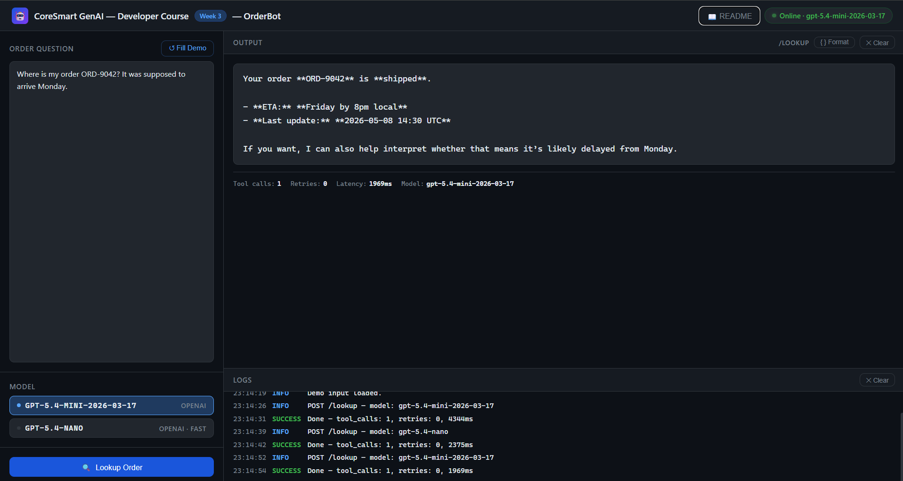

# OrderBot - Week 3

**CoreSmart GenAI Developer Course · Week 3**

OrderBot takes a plain-English order question, runs it through GPT with a `lookup_order_status` tool wired up, and returns a natural-language answer. It demonstrates the three primitives every agent in the rest of the course is built on: a tool-calling loop, bounded retry logic at two distinct layers, and structured telemetry you can alert on.

| Pattern | Endpoint / entry-point | File |
|---|---|---|
| **Tool-calling loop** | `POST /lookup` | `app/llm.py` |
| **Retry-with-correction** | `POST /lookup` | `app/llm.py` |
| **Structured error envelope** | `POST /lookup` | `app/tools.py` |

---

## Project layout

```
/
├── app/
│   ├── __init__.py
│   ├── config.py            <- typed settings + .env loader (pydantic-settings)
│   ├── schemas.py           <- LookupRequest, OrderLookupArgs, OrderStatus, LookupResponse
│   ├── tools.py             <- lookup_order_status tool: JSON Schema, impl, dispatcher 
│   ├── retry.py             <- with_tool_retry decorator (tenacity, bounded backoff)   
│   ├── llm.py               <- call_with_tools(): four-message round-trip + retry-with-correction
│   └── main.py              <- FastAPI routes + /health + /readme + GET /
├── tests/
│   └── test_endpoint.py     <- 9 smoke tests (no real API calls)
├── index.html               <- browser UI (open via http://localhost:8000)
├── week3_1_notebook.ipynb  <- curl + Python requests for every endpoint
├── requirements.txt
├── .env.example             <- copy to .env and fill in OPENAI_API_KEY
├── .gitignore
├── WebUI.png                <- screenshot of the running browser UI (see Section 3 › index.html)
├── README.md                <- you are here
└── retry_state_machine.svg   <- tool loop state machine (six states, two exits)
```

---

## 1. What this app does

- Accepts a natural-language order question and routes it through a bounded tool loop -> `POST /lookup`
- Calls `lookup_order_status(order_id)` as a real tool call, injects the result into the conversation, and returns the model's final answer
- Retries at two independent layers: tool-level (transient network failures, via tenacity) and model-level (malformed arguments, via retry-with-correction prompt)
- Returns structured telemetry (`tool_call_count`, `retry_count`, `latency_ms`) in the response body and as HTTP response headers
- Serves a **browser UI** at `GET /` -- no separate server needed
- Renders this README as HTML at `GET /readme`

It does **not** stream output, run multi-step planning, retrieve from a knowledge base, or route to multiple tools. Those come in later weeks.

---

## 2. Setup (5 min)

> Requirements: Python 3.10+, an OpenAI API key.

```bash
# 1. Create and activate a venv
python -m venv .venv
source .venv/bin/activate          # Windows: .venv\Scripts\activate

# 2. Install dependencies
pip install -r requirements.txt

# 3. Copy env file and fill in real values
cp .env.example .env
# Open .env and set: OPENAI_API_KEY=sk-...

# 4. Start the server
uvicorn app.main:app --reload
```

**You're live at `http://localhost:8000`.**

- Browser UI: `http://localhost:8000`
- Swagger docs: `http://localhost:8000/docs`
- README: `http://localhost:8000/readme`

> **Model versions:** `gpt-5.4-mini-2026-03-17` is the default (`provider=openai`). `gpt-5.4-nano-2026-03-17` is the fast alternative (`provider=nano`). Both are pinned in `config.py` -- never use `-latest` aliases in production; silent upstream model upgrades are how eval numbers drift without warning.

---

## 3. File-by-file walkthrough

Reading order: `config -> schemas -> tools -> retry -> llm -> main`

### `app/config.py` -- Settings

All environment variables live in one typed `Settings` class (powered by `pydantic-settings`).

```python
settings = get_settings()
print(settings.model_name)       # gpt-5.4-mini-2026-03-17 (override with MODEL_NAME in .env)
print(settings.fast_model_name)  # gpt-5.4-nano-2026-03-17             (override with FAST_MODEL_NAME)
```

Two reasons to centralise config here:
1. Reading `os.environ["KEY"]` from random places is how secrets end up in logs.
2. `pydantic-settings` validates types on startup -- a missing key fails loudly before the first request, not mid-flight.

The `@lru_cache` on `get_settings()` means `.env` is read exactly once. Tests can call `get_settings.cache_clear()` to swap settings without restarting the server.

---

### `app/schemas.py` -- Data contracts

```python
class LookupRequest(BaseModel):
    message:  str                           = Field(..., min_length=1)
    provider: Literal["openai", "nano"]     = "openai"

class OrderLookupArgs(BaseModel):
    order_id: str = Field(..., description="Format ORD-NNNN. Do NOT pass an integer.")

class LookupResponse(BaseModel):
    answer:          str
    tool_call_count: int
    retry_count:     int
    provider:        str
    model:           str
    latency_ms:      float
```

`OrderLookupArgs` deserves attention: its `description` is prompt content. OpenAI ships the field descriptions inside the tool's JSON Schema to the model on every call. "Do NOT pass an integer" is a behavioral directive, not a comment.

**Schema-first habit:** define the shape first, then build the prompt around it. Pydantic validates every response -- invalid model output becomes a clean 422/502, never silent garbage downstream.

---

### `app/tools.py` -- Tool definition + dispatcher

**Key design choice:** the tool's arguments are a Pydantic model (`OrderLookupArgs`), and the JSON Schema fed to the OpenAI API is generated directly from that model via `model_json_schema()`. There is no separate schema file to keep in sync.

```python
TOOLS = {
    "lookup_order_status": {
        "name": "lookup_order_status",
        "description": "Call when user asks about an order's status, ETA, or delivery state.",
        "parameters": OrderLookupArgs.model_json_schema(),   # generated, not hand-written
        "impl": lookup_order_status,
        "args_model": OrderLookupArgs,
    }
}
```

`tool_definitions()` formats this registry into OpenAI's `{"type":"function","function":{...,"parameters":...}}` shape. Adding a second tool is adding a second key to `TOOLS`.

`execute_tool(name, args)` is the dispatcher: validates args through the Pydantic model (raises `ValidationError` on bad args so the retry-with-correction loop upstream can catch it), calls the impl, and returns a structured envelope -- never a bare exception. Failures come back as `{"success": false, "error": "order_not_found", "hint": "..."}` so the model can produce a helpful user-facing message.

Two questions to ask of every tool you write:
- **Idempotency** -- what happens if the model calls this twice? (`lookup_order_status` is read-only; calling it twice costs one extra API hit. That's the right blast-radius shape for a first tool.)
- **Blast radius** -- what's the worst outcome if the model fills in wrong values? (A mistyped `order_id` returns a structured not-found envelope, not a database error.)

---

### `app/retry.py` -- Bounded exponential backoff

```python
def with_tool_retry(fn):
    return retry(
        stop=stop_after_attempt(s.tool_retry_max_attempts),     # 3 attempts
        wait=wait_exponential_jitter(initial=0.5, max=8.0),     # 500ms → 8s with jitter
        retry=retry_if_exception_type((httpx.TimeoutException, httpx.NetworkError)),
        reraise=True,
    )(fn)
```

This decorator wraps functions that hit real external services. It retries only on transient network failures -- not on `ValueError` or `ValidationError`, which are bugs, not transient states. Retrying bugs wastes budget.

The `before_sleep` hook emits a structured `tool_impl_transient_failed` event on every backoff. A retry nobody can see is a retry that hides a dying dependency from you right up until it stops working.

In this video the `lookup_order_status` impl is a local fake (no network), so `with_tool_retry` is scaffolded but **deliberately not applied** -- see [Decisions](#8-decisions-the-named-project-memo). The decorator is activated in the next video on `route_to_team`, which is a real side-effect tool. See [Where this goes next](#9-where-this-goes-next).

---

### `app/llm.py` -- The four-message round-trip

Shape A: single LLM wrapper with tool loop.

`call_with_tools(user_message, model_name)` is the complete tool-calling lifecycle:

```
App -> Model:  [system prompt] + [user message] + tool_definitions()
Model -> App:  finish_reason="tool_calls", tool_calls=[{id, name, arguments}]
App:           parse arguments, validate through Pydantic, call execute_tool()
App -> Model:  append assistant message + tool result (role="tool")
Model -> App:  finish_reason="stop", final answer text
App:           return {answer, tool_call_count, retry_count, latency_ms}
```

**Model-level retry-with-correction:** if `execute_tool` raises `ValidationError` (wrong argument shape from the model), the loop catches it, appends the Pydantic error verbatim as a corrective `role="tool"` message, and re-calls the model. Cap: 2 corrections. Above this cap, the failure mode shifts from "the model didn't see its mistake" to "the schema is harder than the prompt explains" -- which needs a prompt edit, not another retry.

**Iteration cap (`tool_loop_max_iterations=5`):** if the model tries to call more than 5 tools in a single turn, `LoopExceededError` is raised and surfaces as HTTP 429. Today with one tool the loop runs at most twice. The cap is there for when you add tools and agent behaviour -- this is the seed of the bounded agent loop formalised in Week 9's OpsAssist.

See **`retry_state_machine.svg`** in this folder for the state machine (idle -> call -> success/fail -> backoff -> retry -> give-up).

---

### `app/main.py` -- FastAPI routes

| Route | Method | What it does |
|---|---|---|
| `/` | GET | Serve browser UI (`index.html`) |
| `/health` | GET | Liveness probe -- returns model names for both providers |
| `/readme` | GET | Render README.md as dark-themed HTML |
| `/lookup` | POST | Full tool-calling round-trip; returns answer + telemetry |

The `_PROVIDER_MODEL` dict maps `provider` field values to pinned model strings. Swapping providers never requires touching `llm.py` or `tools.py`.

Telemetry headers (`X-Tool-Call-Count`, `X-Retry-Count`, `X-Latency-Ms`) echo the response body fields. A curl user can see at a glance whether latency came from multiple tool calls or a correction loop without parsing JSON.

---

### `index.html` -- Browser UI

Open at `http://localhost:8000` after starting the server.



**Left panel:**
- **Order question** textarea (`id="notes"`) - primary input; "↺ Fill Demo" loads a sample question
- **Model selector** - radio cards: `gpt-5.4-mini-2026-03-17` (openai, default) / `gpt-5.4-nano-2026-03-17` (nano, fast)
- **Lookup Order** primary action button with spinner

**Right panel:**
- **Output pane** - answer text rendered above a telemetry footer: tool calls · retries · latency · model name; "{ } Format" button reveals raw JSON; "✕ Clear" resets
- **Logs pane** (fixed 200px) - timestamped entries colour-coded by level (INFO blue, SUCCESS green, ERROR red)

---

### `week3_1_notebook.ipynb` -- API notebook

A Jupyter notebook covering every endpoint two ways (Windows `%%cmd` curl + Python `requests`):

| Section | curl (`%%cmd`) | Python | Needs server + key? |
|---|---|---|---|
| 1 Health check | v | v | yes |
| 2 POST /lookup | v | v | yes |
| 3 Multi-model comparison (openai vs nano) | -- | v | yes |
| 4 Telemetry headers | -- | v | yes |
| 5 Failure: empty message (422) | v | v | yes |
| 6 Failure: retry-with-correction (`tool_arg_validation_failed`) | -- | v | yes |
| 7 Failure: transient tool error (`tool_impl_transient_failed`) | -- | v | **no** |
| 8 Failure: wrong tool choice (`wrong_tool_choice`) | -- | v | **no** |
| 9 Failure: runaway loop (`loop_exceeded` -> 429) | -- | v | **no** |
| 10 Failure: model returns prose (`unexpected_text_response`) | -- | v | **no** |
| 11 Swagger UI link | -- | v | -- |

Sections 7 - 10 import `app/` directly and stub the model, so they run with no server and no API key. This is where the failure modes in Section 6 of this README are actually exercised -- see the note at the top of that section.

All `%%cmd` cells use Windows double-quote syntax -- single quotes cause errors in `cmd.exe`.


---

## 4. Try it out

### a) Health check

```bash
curl http://localhost:8000/health
# {"status":"ok","model":"gpt-5.4-mini-2026-03-17","models":{"openai":"gpt-5.4-mini-2026-03-17","nano":"gpt-5.4-nano-2026-03-17"}}
```

### b) Happy path -- tool called once, no retries

```bash
curl -X POST http://localhost:8000/lookup ^
  -H "Content-Type: application/json" ^
  -d "{\"message\": \"Where is order ORD-1042?\", \"provider\": \"openai\"}"
```

Expected response body (trimmed):
```json
{
  "answer": "Your order ORD-1042 has shipped and is expected to arrive...",
  "tool_call_count": 1,
  "retry_count": 0,
  "provider": "openai",
  "model": "gpt-5.4-mini-2026-03-17",
  "latency_ms": 312.4
}
```

Response headers include `X-Tool-Call-Count: 1` and `X-Retry-Count: 0`.

### c) Structured not-found envelope

```bash
curl -X POST http://localhost:8000/lookup ^
  -H "Content-Type: application/json" ^
  -d "{\"message\": \"Where is order ORD-9999?\", \"provider\": \"openai\"}"
```

The tool raises `OrderNotFoundError`. `execute_tool` catches it and returns `{"success": false, "error": "order_not_found", "hint": "..."}`. The model incorporates this into a clean user-facing message -- no stack trace leaks.

### d) Retry-with-correction trigger

```bash
curl -X POST http://localhost:8000/lookup ^
  -H "Content-Type: application/json" ^
  -d "{\"message\": \"Just check order 42 for me\", \"provider\": \"openai\"}"
```

"order 42" may push the model to send `order_id=42` (an int, not `"ORD-42"`). Pydantic raises `ValidationError`. Watch the server logs for `event: tool_arg_validation_failed`. The `retry_count` field in the response will be `1` if the correction loop fired.

---

## 5. Diagrams

| File | What it shows |
|---|---|
| `retry_state_machine.svg` | Tool loop state machine: idle -> model call -> tool_calls check -> dispatch -> success/fail -> backoff -> retry -> give-up. Six states, two exits. |

---

## 6. Common failure modes

### Every failure mode below is exercised in the notebook
Sections 7 - 10 run **in-process with the model stubbed** - no server, no API key, no tokens spent. Run them, break them, change the numbers, run them again.
| Failure mode | Log tag | Where it runs |
|---|---|---|
| §6a Invalid tool arguments | `tool_arg_validation_failed` | Notebook **§6** - live model, ambiguous "order 42" prompt (statistical: may take a re-run) |
| §6b Transient tool error | `tool_impl_transient_failed` | Notebook **§7** - applies `@with_tool_retry` to a flaky copy of the tool that times out once, then succeeds |
| §6c Wrong tool choice | `wrong_tool_choice` | Notebook **§8** - calls `execute_tool` with a name that isn't in `TOOLS` |
| §6d Runaway loop | `loop_exceeded` -> HTTP 429 | Notebook **§9** - stubs a model that never stops asking for the tool |
| §6e Model returns prose | `unexpected_text_response` | Notebook **§10** - stubs a model that answers in text; `tool_call_count` comes back `0` |
> Section 6 of the notebook needs the server running and an API key. Sections 7 - 10 need neither.

### a) Invalid tool arguments -- retry-with-correction fires

The model calls `lookup_order_status(order_id=42)` -- an integer, not a string. Pydantic raises `ValidationError` because `order_id` is typed as `str`. The `call_with_tools` loop catches this, builds a corrective message containing the validator's error detail (the `e.errors()` JSON), and re-calls the model. Watch for `event: tool_arg_validation_failed` in the server log. The `retry_count` field in the response will be `1`.

Diagnostic path: check the `description` on `OrderLookupArgs.order_id` -- the model reads it on every call. Tighten the wording ("Do NOT pass an integer. Format: ORD-NNNN") to reduce the frequency of this failure.

### b) Transient tool error -- tenacity catches

Apply `@with_tool_retry` to `lookup_order_status` and make it raise `httpx.TimeoutException` on the first call only. The decorator catches it, `before_sleep` fires `_log_transient_failure` (which emits `event: tool_impl_transient_failed`), tenacity backs off ~500ms, and the second attempt succeeds. **The model never sees the failure** -- the retry happened *below* the model, at the dispatcher layer. Note what this means for your telemetry: `retry_count` in the response stays at **0**, because that counter tracks *model-level* corrections. The only trace in the response is roughly 500ms of extra latency.

That is the layering working as designed, and it is also the danger: **retries hide a degrading dependency.** Alert on a rising `tool_impl_transient_failed` rate. It is the difference between finding out on your dashboard and finding out when the retries stop working.

> **Note -- the decorator is deliberately NOT applied in the shipped code.** `with_tool_retry` is scaffolded in `retry.py` and left unwired, because `lookup_order_status` is a local function: it has no network, so it has no transient failure mode, and decorating it would be theatre. **Apply `@with_tool_retry` the moment you replace the fake with a real HTTP call**

### c) The model calls a tool that doesn't exist -- `wrong_tool_choice`

`execute_tool` is handed a name that isn't in `TOOLS`. It does **not** raise: it logs `event: wrong_tool_choice` (with the list of tools it does know about) and returns `{"success": false, "error": "unknown_tool", "tool": "..."}`. With one tool in the registry this is nearly impossible; with six tools whose descriptions have drifted together over a year of edits, it is a Tuesday.

Diagnostic path: a rising `wrong_tool_choice` rate almost always means two tool *descriptions* have converged to the point where the model can no longer tell them apart. Fix the descriptions, not the dispatcher.

### d) The loop won't stop -- `loop_exceeded`

The model keeps asking for tools past `tool_loop_max_iterations` (5). `call_with_tools` logs `event: loop_exceeded` with the tool-call count, raises `LoopExceededError`, and `main.py` maps that to **HTTP 429**. This is the runaway-agent guard. It is the difference between a bad afternoon and a bad invoice.

### e) Model returns text instead of a tool call -- `unexpected_text_response`

A prompt variant causes the model to say "I don't have access to that information" instead of calling `lookup_order_status`. This is the quiet one, and it has two shapes:

- **`finish_reason == "stop"`** -- the model simply answered in prose. The loop takes the "model is done" branch, returns that prose as the answer, and the service replies **HTTP 200 with `tool_call_count: 0`**. Nothing crashed. Nothing retried. The response is useless and it looks fine. *This shape is invisible unless you count it* -- alert on `tool_call_count == 0` for questions that should always hit a tool.
- **`finish_reason == "tool_calls"` with an empty `tool_calls` list** -- a degenerate response. `call_with_tools` logs `event: unexpected_text_response` and breaks out of the loop.

Diagnostic path: the Format directive at the end of `SYSTEM_PROMPT` in `llm.py` ("Use the lookup_order_status tool. Do not respond in prose...") is what holds this failure rate down. Delete it and the rate climbs. A spike in `unexpected_text_response`, or in zero-tool-call responses, often correlates with a provider model update -- retest the prompt against the new version.

---

## 7. Run the tests

```bash
pytest -q
```

9 smoke tests -- no real API calls, no OpenAI key needed:

| Test | What it checks |
|---|---|
| `test_health` | `/health` returns 200 with `status`, `model`, and `models` keys |
| `test_lookup_validation_rejects_empty_message` | Empty `message` returns 422 before any model call |
| `test_dispatcher_runs_lookup_directly` | `execute_tool` returns correct `OrderStatus` for a valid `order_id` |
| `test_dispatcher_returns_structured_error_envelope_on_not_found` | `ORD-9999` returns `{"success": false, "error": "order_not_found"}` -- never an exception |
| `test_dispatcher_rejects_unknown_tool` | Unknown tool name returns `{"success": false, "error": "unknown_tool"}` |
| `test_dispatcher_raises_on_malformed_args` | `order_id=42` (int) raises `ValidationError` so the retry loop can catch it |
| `test_args_model_description_is_prompt_content` | `OrderLookupArgs` field description contains "ORD-" hint |
| `test_lookup_endpoint_with_stubbed_model` | Full HTTP round-trip with OpenAI client stubbed; verifies tool-call -> result -> answer wiring |
| `test_retry_with_correction_recovers` | The correction loop **recovers**: the stub sends `order_id=42` (int), then `"ORD-42"`, then the answer. Asserts HTTP 200, `retry_count == 1`, and `X-Retry-Count: 1` |

> The last one is the one that matters. Anyone can test that a validator rejects bad input; `test_dispatcher_raises_on_malformed_args` does that. **`test_retry_with_correction_recovers` tests that the system gets back up** -- which is the actual claim this repo makes. A correction loop that fires but never converges is just a slower way to fail.

Smoke tests are not a replacement for integration tests -- those come in Week 14's DeployCore. They're a `pytest -q` you can run after every refactor to confirm the contract holds.

---

## 8. Decisions

Every named project in this course ships with a Decisions section. **Two sentences per decision, in writing, in the repo.** Future-you can nod and move on, or argue with the choice and redo it on purpose. What you cannot do is wonder.

- **Rung 4 (tool calling) with Rung 3 (Pydantic validation) on top, not Rung 5 (provider strict mode).** Rung 4 is portable: the JSON Schema we send is generated from `OrderLookupArgs.model_json_schema()`, and the same schema ports unchanged to Anthropic or to any OpenAI-compatible endpoint - which is what the per-request `provider` field, and the multi-provider routing it seeds, actually needs. Rung 5's vendor-strict dialect would buy us a guarantee we can already get for the price of one `model_validate()` call, and would couple this tool's arguments to one vendor's strict-mode quirks.
- **Rung 3 validation is not redundant, it is the retry trigger.** `execute_tool` validates the model's arguments through Pydantic and **raises** on failure rather than coercing. That raise is the entire point: it is what the retry-with-correction loop in `llm.py` catches, and it is what lets us hand the model the validator's own error object verbatim. A dispatcher that quietly cast `42` to `"42"` would have hidden the model's mistake from us forever.
- **Two retry layers, kept apart, in separate files.** Tool-level (tenacity, `retry.py`) handles transient *infrastructure* failure and retries below the model. Model-level (retry-with-correction, `llm.py`) handles *semantic* failure and retries above it. They have different budgets (3 attempts vs 2 corrections), different triggers, and different telemetry (`tool_impl_transient_failed` vs `tool_arg_validation_failed`). Merging them into one "retry" concept is how you end up retrying a `ValidationError` three times with exponential backoff - burning budget on a bug that will never fix itself.
- **A hard cap of 2 corrections, and a hard cap of 5 loop iterations.** Below those caps you are giving the model another chance with new information in hand. Above them the failure mode has changed - from "the model didn't see its mistake" to "the schema is harder than the prompt explains" (needs a prompt edit) or "the model is looping" (needs a circuit breaker, and a 429). Both caps live in `config.py`, so the retry budget is a number in code, not a number in someone's head.
- **`with_tool_retry` is defined and deliberately not applied.** The tool is a local function; it cannot time out. Wiring a network-retry decorator around it would be theatre, and theatre in a teaching repo is worse than an honest gap.

---

## 9. Where this goes next

- This same `tools.py` and `retry.py` inside a Pydantic-enforced intake schema and an SSE streaming endpoint. The `with_tool_retry` decorator you read about in Section 3 is activated there on `route_to_team`.
- Run adversarial inputs against this exact dispatcher and asserts the structured failure event tags (`tool_arg_validation_failed`, `unexpected_text_response`). You'll need the telemetry you built here.
- The `tool_loop_max_iterations` cap and the `TOOLS` registry pattern become a formal bounded agent loop with branching tool choice and state diagrams.
- This dispatcher is lifted into an MCP server so other agents can call `lookup_order_status` over an agent-to-agent protocol.

Don't throw this away -- every week builds on it.
