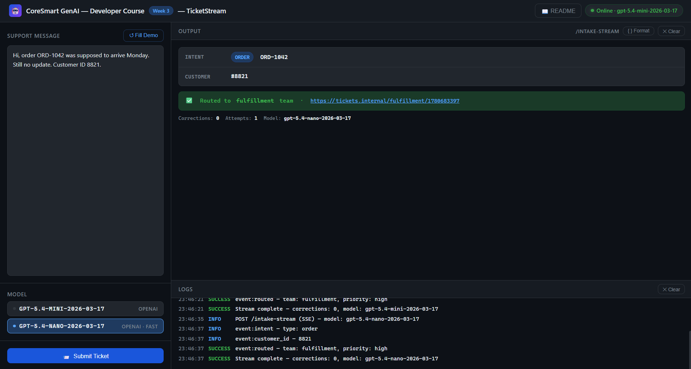

# TicketStream - Week 3

**CoreSmart GenAI Developer Course · Week 3 · TicketStream**

TicketStream takes a free-text support message, extracts a fully validated Pydantic ticket (discriminated intent union, Literal priority enum), streams the ticket fields back to the client one-by-one as Server-Sent Events, and -- once validation passes -- routes the ticket to a team via a side-effect tool.

| Pattern | Endpoint / entry-point | File |
|---|---|---|
| **Validate-first, stream-second** | `POST /intake-stream` | `app/llm.py` + `app/main.py` |
| **Discriminated union schema** | `POST /intake-stream` | `app/schemas.py` |
| **Side-effect gating** | `POST /intake-stream` | `app/tools.py` + `app/main.py` |

---

## Project layout

```
/
├── app/
│   ├── __init__.py
│   ├── config.py            <- typed settings + .env loader (pydantic-settings)
│   ├── schemas.py           <- TicketSchema (discriminated union), IntakeRequest, RoutingResult
│   ├── tools.py             <- EXTRACT_TICKET_TOOL (model-facing) + route_to_team (side-effect, NOT model-facing)
│   ├── retry.py             <- with_tool_retry decorator (tenacity, bounded backoff)  <- carried from previous video
│   ├── llm.py               <- validate_and_correct(): async extraction with retry-with-correction
│   └── main.py              <- intake_generator() SSE stream + /intake-stream + /health + /readme + GET /
├── tests/
│   └── test_intake_stream.py  <- 7 smoke tests (no real API calls)
├── index.html                 <- browser UI (open via http://localhost:8000)
├── week3_2_notebook.ipynb    <- curl + Python requests for every endpoint
├── pytest.ini
├── requirements.txt
├── .env.example               <- copy to .env and fill in OPENAI_API_KEY
├── .gitignore
├── WebUI.png                  <- screenshot of the running browser UI (see Section 3 › index.html)
├── README.md                  <- you are here
└── ticketstream_architecture.svg  <- full pipeline architecture (four lanes, validate-first gate)
```

> `schemas.py` is significantly extended from previous video's baseline -- it introduces discriminated unions, a `Literal` priority enum, and nested `Attachment` models.
> `tools.py` has two tools with a deliberate asymmetry: `EXTRACT_TICKET_TOOL` is model-facing; `route_to_team` is not. See Section 3 for why.

---

## 1. What this app does

- Accepts a free-text support message and extracts a structured `TicketSchema` via an LLM tool call -> `POST /intake-stream`
- Validates the extracted ticket through Pydantic before emitting a single SSE frame (validate-first, stream-second)
- Streams the validated ticket fields one-by-one as typed SSE events (`intent`, `priority`, `customer_id`, `routed`, `done`)
- Routes the ticket to a team queue via `route_to_team` -- a side-effect tool that is **never** exposed to the model directly
- Retries schema validation failures with a corrective prompt (retry-with-correction) before yielding `validation_failed`
- Serves a **browser UI** at `GET /` -- no separate server needed
- Renders this README as HTML at `GET /readme`

It does **not** stream raw token deltas, perform retrieval, run multi-step agent loops, or apply auth or PII scrubbing. Those come in later weeks.

---

## 2. Setup (5 min)

> Requirements: Python 3.10+, an OpenAI API key.

```bash
# 1. Create and activate a venv
python -m venv .venv
source .venv/bin/activate          # Windows: .venv\Scripts\activate

# 2. Install dependencies
pip install -r requirements.txt

# 3. Copy env file and fill in real values
cp .env.example .env
# Open .env and set: OPENAI_API_KEY=sk-...

# 4. Start the server
uvicorn app.main:app --reload
```

**You're live at `http://localhost:8000`.**

- Browser UI: `http://localhost:8000`
- Swagger docs: `http://localhost:8000/docs`
- README: `http://localhost:8000/readme`

> **Model versions:** `gpt-5.4-mini-2026-03-17` is the default (`provider=openai`). `gpt-5.4-nano-2026-03-17` is the fast alternative (`provider=nano`). Both are pinned in `config.py`.
>
> **Streaming curl:** use the `-N` flag to disable buffering so SSE frames appear as they arrive: `curl -N -X POST ...`.

---

## 3. File-by-file walkthrough

Reading order: `config -> schemas -> tools -> retry -> llm -> main`

### `app/config.py` -- Settings

All environment variables live in one typed `Settings` class. The SSE-specific knob added in :

```python
settings = get_settings()
print(settings.model_name)                  # gpt-5.4-mini-2026-03-17
print(settings.fast_model_name)             # gpt-5.4-nano-2026-03-17
print(settings.schema_correction_max_attempts)  # 2  (retry-with-correction cap)
print(settings.sse_keepalive_seconds)       # 15 (keepalive for idle SSE connections behind proxies)
```

`sse_keepalive_seconds` is available for keepalive pings on long-lived SSE connections -- firewalls drop idle connections if nothing flows for 30-60 seconds. The `@lru_cache` on `get_settings()` means `.env` is read exactly once.

---

### `app/schemas.py` -- Discriminated union schema

This file has more structure than previous video because the intent field is a **discriminated union** -- one of three shapes, selected by a `type` discriminator.

```python
class OrderIntent(BaseModel):
    type:     Literal["order"] = "order"
    order_id: str

class RefundIntent(BaseModel):
    type:     Literal["refund"] = "refund"
    order_id: str
    reason:   str = Field(..., min_length=3)

class BillingIntent(BaseModel):
    type:       Literal["billing"] = "billing"
    invoice_id: str

IntentType = Annotated[
    Union[OrderIntent, RefundIntent, BillingIntent],
    Field(discriminator="type"),
]

class TicketSchema(BaseModel):
    intent:      IntentType
    priority:    Literal["low", "medium", "high", "critical"]
    customer_id: int | None = None
    attachments: list[Attachment] = []
```

The discriminated union has two benefits. Validation is fast and error messages are precise: Pydantic doesn't try all three classes and pick the one that doesn't fail -- it uses `type` to go direct. The generated JSON Schema contains a `oneOf` with a discriminator hint, which the model reads when deciding what arguments to produce for `extract_ticket`.

The `priority` `Literal` is the exact constraint that makes the retry-with-correction failure mode demonstrable: if the model produces `"urgent"`, Pydantic rejects it immediately.

**Schema-first habit:** every `description` field on `TicketSchema` is prompt content. "Use 'critical' ONLY for outages that block users from receiving their order" is a behavioral directive, not documentation.

> Note: `IntakeRequest` also accepts an optional `customer_id` in the POST body, but the pipeline does not use it yet -- extraction is model-driven, so the `customer_id` in the SSE frames comes from the model-extracted `TicketSchema`, not from the request body.

---

### `app/tools.py` -- Two tools with a deliberate asymmetry

TicketStream has two tools, and the design distinction between them is the key concept of this video:

**`EXTRACT_TICKET_TOOL`** (model-facing) is in the OpenAI function-calling format:
```python
EXTRACT_TICKET_TOOL = {
    "type": "function",
    "function": {
        "name": "extract_ticket",
        "description": "Extract a structured Ticket from the intake message. Always call this tool.",
        "parameters": TicketSchema.model_json_schema(),  # full schema shipped to model on every call
    }
}
```

**`route_to_team(team, priority)`** (side-effect, NOT model-facing) is a Python function that routes the validated ticket to a team queue. It is never in the tool list sent to the API. The model cannot call it. Our code calls it -- in `main.py` -- exactly after the Pydantic gate passes.

This is the **safety pattern**: side-effect tools are gated behind validated structured intent. If the model produces garbage, the schema gate stops the side effect. The model's job is to produce the structured ticket. Our code's job is to decide what to do with it. Week 12's GuardianAI formalises this into a full RBAC + PII layer; the pattern is the same.

`team_for_intent(ticket)` is a pure function that maps `intent.type` to a team queue string. It's in code, not in a prompt, because routing logic must be auditable, testable, and deterministic. A prompt saying "route billing issues to billing" can drift when the model is updated. A Python dict cannot.

Two questions to ask of every tool you write:
- **Idempotency** -- `route_to_team` creates a ticket URL. Calling it twice creates two URLs. Make the caller idempotent (the `@with_tool_retry` decorator retries on transient failures, not on success).
- **Blast radius** -- the side-effect tool never fires without a valid `TicketSchema`. That's the gate.

---

### `app/retry.py` -- Bounded exponential backoff

Identical shape to previous video's `retry.py`. In current it is **actively applied** on `_route` in `main.py`:

```python
@with_tool_retry          # <- activated here, unlike previous video where it's scaffolding
def _route(team: str, priority: str):
    return route_to_team(team, priority)
```

This means every call to `route_to_team` runs inside Tenacity: 3 attempts, exponential backoff from 500ms to 8s, retries only on `httpx.TimeoutException` / `httpx.NetworkError`. If all attempts fail the exception propagates up and `intake_generator` catches it, yielding `event: validation_failed` with `stage: "post_validate"`.

---

### `app/llm.py` -- Async extraction with retry-with-correction

Shape A: async single LLM wrapper with retry-with-correction loop.

`validate_and_correct(user_message, model_name)` is the extraction lifecycle:

```
App -> Model:  [system prompt] + [user message] + EXTRACT_TICKET_TOOL
Model -> App:  finish_reason="tool_calls", tool_calls=[{name: "extract_ticket", arguments: {...}}]
App:           TicketSchema.model_validate(args) -- may raise ValidationError
  on success:  return (TicketSchema, telemetry)
  on failure:  append corrective message with error verbatim, re-call model (max 2 corrections)
  if name is None (model emitted prose): return (None, telemetry) immediately -- no retry
```

**Async because:** the SSE endpoint (`intake_stream`) is an async generator. Mixing a sync LLM call inside it would block the event loop and silently prevent frames from flushing. `AsyncOpenAI` keeps the event loop free while waiting for the model.

**`_aextract_once`** is one model call. It returns `(tool_name, tool_args, finish_reason)`. If the model emitted prose instead of a tool call, it returns `(None, None, finish_reason)` -- e.g. `(None, None, "stop")` -- so the caller can log what actually happened. The caller (`validate_and_correct`) handles the `None` case immediately -- re-prompting a model that ignored the tool list once is unlikely to help; the prompt needs fixing, not another call.

---

### `app/main.py` -- FastAPI routes

| Route | Method | What it does |
|---|---|---|
| `/` | GET | Serve browser UI (`index.html`) |
| `/health` | GET | Liveness probe -- returns model names for both providers |
| `/readme` | GET | Render README.md as dark-themed HTML |
| `/intake-stream` | POST | Full validate-first-stream-second SSE pipeline |

**`intake_generator(req)`** is the async generator. Walk through it in order:

1. Call `validate_and_correct` (blocks until a valid `TicketSchema` exists or retries are exhausted).
2. If `ticket is None`: yield `event: validation_failed`, yield `event: done`, return. No side effects.
3. Yield `event: intent`, `event: priority`, `event: customer_id` one-by-one with `await asyncio.sleep(0)` between each to let the event loop flush the frame before continuing.
4. Call `_route(team, priority)` -- `route_to_team` wrapped in `@with_tool_retry`. On success, yield `event: routed`. On failure after all retries, yield `event: validation_failed` with `stage: "post_validate"`.
5. Yield `event: done` with telemetry.

**SSE headers:** `Cache-Control: no-cache` tells CDNs not to cache the stream. `X-Accel-Buffering: no` tells nginx (and nginx-based proxies) not to buffer the streamed body; other proxies have their own equivalents. Forgetting this produces a service that works in local development and silently buffers everything behind a buffering reverse proxy in production.

---

### `index.html` -- Browser UI

Open at `http://localhost:8000` after starting the server.



**Left panel:**
- **Support message** textarea (`id="notes"`) - primary input; "↺ Fill Demo" loads a sample intake
- **Model selector** - radio cards: `gpt-5.4-mini-2026-03-17` (openai, full reasoning) / `gpt-5.4-nano-2026-03-17` (nano, fast)
- **Submit Ticket** primary action button with spinner

**Right panel:**
- **Output pane** - live ticket card that fills field-by-field as SSE events arrive: INTENT badge (order / refund / billing) with order ID, PRIORITY colour chip (critical red · high orange · medium blue · low grey), CUSTOMER ID, green routing banner showing team + ticket URL, done telemetry footer (corrections · attempts · model); "{ } Format" reveals raw event log
- **Logs pane** (Bottom) - timestamped SSE event entries: event name, INFO/SUCCESS/ERROR colour-coded

---

### `week3_2_notebook.ipynb` -- API notebook

A Jupyter notebook covering every endpoint two ways (Windows `%%cmd` curl + Python `requests`):

| Section | curl (`%%cmd`) | Python | Needs server + key? |
|---|---|---|---|
| 1 Health check | v | v | yes |
| 2 POST /intake-stream (SSE stream) | v (-N flag) | v | yes |
| 3 Multi-model comparison (openai vs nano) | -- | v | yes |
| 4 Schema validation -- all three intent types | -- | v | yes |
| 5 Failure: empty message (422) | v | v | yes |
| 6 Failure: schema reject with retry-correct (live model) | -- | v | yes |
| 7 Failure: schema correction, deterministic (`tool_arg_validation_failed`, `schema_correction_exhausted`) | -- | v | **no** |
| 8 Failure: mid-stream routing failure (`tool_impl_transient_failed`) | -- | v | **no** |
| 9 Failure: model emits prose (`unexpected_text_response`) | -- | v | **no** |
| 10 Swagger UI link | -- | v | -- |

Sections 7 - 9 import `app/` directly and stub the model, so they run with no server and no API key. This is where the failure modes in Section 6 of this README are actually exercised -- see the note at the top of that section.

---

## 4. Try it out

### a) Health check

```bash
curl http://localhost:8000/health
# {"status":"ok","model":"gpt-5.4-mini-2026-03-17","models":{"openai":"gpt-5.4-mini-2026-03-17","nano":"gpt-5.4-nano-2026-03-17"}}
```

### b) Happy path -- clean intake, watch SSE frames stream in

```bash
curl -N -X POST http://localhost:8000/intake-stream ^
  -H "Content-Type: application/json" ^
  -d "{\"message\": \"Where is order ORD-1042? Customer ID 8821.\", \"provider\": \"openai\"}"
```

Expected SSE frames in order:
```
event: intent
data: {"type":"order","order_id":"ORD-1042"}

event: priority
data: "high"

event: customer_id
data: {"value":8821}

event: routed
data: {"team":"fulfillment","priority":"high","ticket_url":"https://tickets.internal/fulfillment/..."}

event: done
data: {"ok":true,"correction_count":0,"attempts":1,"model":"gpt-5.4-mini-2026-03-17"}
```

### c) Schema correction trigger -- out-of-enum priority

```bash
curl -N -X POST http://localhost:8000/intake-stream ^
  -H "Content-Type: application/json" ^
  -d "{\"message\": \"SUPER URGENT DROP EVERYTHING order ORD-1042 is missing\", \"provider\": \"openai\"}"
```

Watch the server log for `event: tool_arg_validation_failed`. If the correction loop succeeds you still see `event: priority` in the stream -- with a slight delay but no failure indication. The gate caught and fixed it silently.

### d) nano model -- same pipeline, smaller model

```bash
curl -N -X POST http://localhost:8000/intake-stream ^
  -H "Content-Type: application/json" ^
  -d "{\"message\": \"I want a refund on order ORD-2222, it arrived damaged.\", \"provider\": \"nano\"}"
```

The discriminated union should resolve to `RefundIntent`. Compare the `correction_count` in the `done` frame against the `openai` provider to see if the smaller model needs more corrections.

---

## 5. Diagrams

| File | What it shows |
|---|---|
| `ticketstream_architecture.svg` | Full pipeline: intake message -> LLM extraction -> Pydantic gate -> SSE field stream -> side-effect routing tool. Four lanes, validate-first gate clearly marked. |

---

## 6. Common failure modes

> ### Every failure mode below is exercised in the notebook
>
> The video walks the *code paths* these failures take. It does not stage them on camera - **`week3_2_notebook.ipynb` fires each one for you**, against these exact modules, and prints the structured log tag it emits.
>
> Sections 7 - 9 run **in-process with the model stubbed** - no server, no API key, no tokens spent. They drive the real `validate_and_correct` and the real `intake_generator`, so what you see is the shipped pipeline, not a mock of it.
>
> | Failure mode | Log tag | Where it runs |
> |---|---|---|
> | §6a Schema reject, correction **recovers** | `tool_arg_validation_failed` | Notebook **§6** (live model, statistical) and **§7** (stubbed: `priority: "urgent"` then `"high"` - `correction_count` comes back `1`) |
> | §6a Schema reject, correction **never converges** | `schema_correction_exhausted` | Notebook **§7** - a stubborn stub that returns `"urgent"` every time; the cap holds, `ticket` is `None`, nothing is routed |
> | §6b Mid-stream routing failure, tenacity **recovers** | *(silent by design - see below)* | Notebook **§8** - `route_to_team` times out once, then succeeds; the client still sees `routed`, just later |
> | §6b Mid-stream routing failure, retries **exhausted** | `tool_impl_transient_failed` | Notebook **§8** - a dead routing service; the stream ends `validation_failed` (`stage: post_validate`) + `done` |
> | §6c Model emits prose instead of a tool call | `unexpected_text_response` | Notebook **§9** - stream ends `validation_failed` + `done`, and `route_to_team` is called **zero** times |


### a) Schema reject with retry-with-correction

The model produces `priority: "urgent"` -- not in `Literal["low","medium","high","critical"]`. Pydantic raises `ValidationError` immediately. `validate_and_correct` logs `event: tool_arg_validation_failed`, appends the validator's error detail (the `e.errors()` JSON) to the conversation as a corrective `role="tool"` message, and re-calls the model. Second attempt should produce a valid priority. The stream emits the field frames with a brief delay. `correction_count` in the `done` frame will be `1`.

Diagnostic path: the `priority` field's `description` in `TicketSchema` is prompt content. Tighten it: "Use 'critical' ONLY for complete service outages. Use 'high' for delivery delays. Never invent values."

### b) Mid-stream routing failure -- tenacity catches

`route_to_team` raises `httpx.TimeoutException` on the first call (monkey-patch in tests). The `@with_tool_retry` decorator catches it, backs off 500ms, retries. If the second call succeeds, the user sees `event: routed` after a small delay -- no failure indication, no interruption to the earlier field frames. If all retries fail, `intake_generator` catches the final exception and yields `event: validation_failed` with `stage: "post_validate"`; the pipeline then falls through and yields the terminal `event: done` with `ok: true` plus the extraction telemetry -- the `validation_failed` frame with `stage: "post_validate"` is the routing-failure signal, not the `done` frame.

Diagnostic path: `event: tool_impl_transient_failed` in the server log. Alert if this exceeds a threshold -- it indicates the downstream routing service is unstable.

### c) Model emits prose instead of a tool call

A prompt variant causes the model to respond with text (e.g. "I'd be happy to help with your order") instead of calling `extract_ticket`. `_aextract_once` returns `(None, None, "stop")`. `validate_and_correct` logs `event: unexpected_text_response` and returns `(None, telemetry)` without retrying -- re-prompting with the same messages won't help; the prompt needs a stronger directive.

`intake_generator` yields `event: validation_failed` and `event: done`. No `route_to_team` call happens. The safety gate held.

Diagnostic path: a spike in `unexpected_text_response` log events correlates with provider model updates. Retest `SYSTEM_PROMPT` against the updated model -- add "Respond ONLY by calling the `extract_ticket` tool. Never respond in prose."

---

## 7. Run the tests

```bash
pytest -q
```

7 smoke tests -- no real API calls, no OpenAI key needed:

| Test | What it checks |
|---|---|
| `test_health` | `/health` returns 200 |
| `test_team_routing_is_deterministic` | `team_for_intent` returns correct team string for order and refund intents |
| `test_route_to_team_returns_typed_result` | `route_to_team` returns a `RoutingResult` with correct fields |
| `test_ticket_schema_rejects_invalid_priority` | `priority="urgent"` raises `ValidationError` at schema boundary |
| `test_ticket_schema_discriminator_picks_subclass` | `type="refund"` resolves to `RefundIntent`, not `OrderIntent` |
| `test_intake_generator_emits_frames_in_order` | SSE events arrive as `intent, priority, customer_id, routed, done` -- in that order |
| `test_intake_generator_emits_validation_failed_when_model_fails` | When `validate_and_correct` returns `None`, stream emits `validation_failed, done` and nothing else |

The last two tests drive the async generator directly with a monkeypatched `validate_and_correct`, so the full streaming pipeline is exercised without network calls.

---

## Decisions (the named-project memo)

Every named project in this course ships with a Decisions section. Two sentences per decision, in writing, in the repo. Future-you can nod and move on, or argue with the choice and redo it on purpose.

- **Rung 4 (tool calling) with Rung 3 Pydantic validation on top, not Rung 5 (provider strict mode).** Rung 4 is portable across providers, which matters for multi-provider routing plan. Rung 5's vendor-strict dialect couples the intake schema tighter to one provider than that routing plan can absorb.
- **SSE, not WebSockets.** The data flow is one-way -- intake goes in, validated fields stream out. SSE rides plain HTTP, is debuggable with curl, and is friendlier to corporate proxies than WebSocket upgrades.
- **Validate first, stream second.** Partial JSON is not validatable. A side-effect tool behind a half-typed object is a production footgun. We get the full structured object, validate once, then synthesise the streaming experience by yielding fields from the already-validated ticket.
- **Hard cap of 2 correction retries.** Below this cap, the model has another chance with the validator error in hand. Above it, the failure mode shifts from "the model didn't see its mistake" to "the schema is harder than the prompt explains" -- which needs a prompt edit, not another retry.

---

## 8. Where this goes next

- Run adversarial intakes against this exact pipeline and asserts the structured failure tags it produces (`tool_arg_validation_failed`, `unexpected_text_response`, `schema_correction_exhausted`). You'll need the telemetry you built here.
- Add the formal RBAC + PII scrubbing layer on top. The validate-first-stream-second pattern is unchanged; the Pydantic gate just becomes more rigorous and the side-effect boundary becomes explicit policy.
- Add a streaming UI that uses the `event:` names defined here (`intent`, `priority`, `customer_id`, `routed`, `done`) to animate ticket fields appearing one at a time.
- Version `SYSTEM_PROMPT` under `prompts/extract_ticket.md` so a schema-correction regression points at a specific commit rather than a vague "prompt changed."

Don't throw this away -- every week builds on it.
