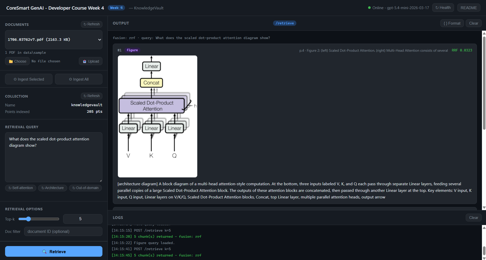

# KnowledgeVault - Week 4

**Applied GenAI & Agentic AI Engineering Course · Week 4**

KnowledgeVault takes an engineering PDF and builds a searchable index of its prose, figures, and tables. It demonstrates the three patterns that recur in every production RAG system built later in this course: a vision LLM forced into structured output via function-calling, text-only embedding via `text-embedding-3-large`, and hybrid retrieval fused with reciprocal rank fusion. Nothing here is hidden behind a framework.

| Pattern | Endpoint / entry-point | File |
|---|---|---|
| **Forced function-calling - structured vision output** | `python -m app.ingest --pdf ...` | `app/llm.py` |
| **Schema-first RAG pipeline** | all endpoints | `app/schemas.py` |
| **Hybrid retrieval - dense text + BM25 + RRF** | `POST /retrieve` | `app/retriever.py` |

---

## Project layout

```
/
├── app/
│   ├── __init__.py
│   ├── config.py        ← typed settings + .env loader (pydantic-settings)
│   ├── schemas.py       ← Pydantic models for every pipeline stage
│   ├── tools.py         ← record_figure_description function schema + dispatcher
│   ├── llm.py           ← OpenAI vision wrapper - forces function-calling
│   ├── parser.py        ← PyMuPDF + pdfplumber layout-aware parser
│   ├── vision.py        ← thin alias for llm.describe_figure + confidence filter
│   ├── chunker.py       ← 300-token prose children in 1,500-token parents, figure chunks, table-row chunks
│   ├── embedder.py      ← text-embedding-3-large (3072-dim), SHA-256 cache
│   ├── store.py         ← the one place that builds a Qdrant client: local (embedded) or server
│   ├── indexer.py       ← Qdrant upsert - single 3072-dim cosine collection
│   ├── retriever.py     ← hybrid retrieve: dense text + BM25 + RRF, optional parent widening
│   ├── ingest.py        ← CLI orchestrator: parse → describe → chunk → embed → index
│   └── main.py          ← FastAPI routes
├── tests/
│   ├── __init__.py
│   └── test_endpoint.py ← smoke tests (no real API calls)
├── index.html                       ← browser UI (open via http://localhost:8000)
├── WebUI.png                        ← screenshot of the browser UI
├── week4_notebook.ipynb             ← curl + Python requests for every endpoint
├── knowledgevault_architecture.svg  ← full pipeline diagram (ingest + retrieve paths)
├── ingestion_sequence.svg           ← five-lane ingestion sequence with failure points
├── retrieval_flow_hybrid.svg        ← dense text + BM25 + RRF fusion diagram
├── requirements.txt
├── .env.example             ← copy to .env and fill in
├── .gitignore
├── data/
│   ├── sample/              ← put PDFs here. The demo paper is arxiv.org/pdf/1706.03762, saved as attention-is-all-you-need.pdf
│   └── figures/             ← extracted figure PNGs (auto-created on first ingest)
├── qdrant_local/                    ← the embedded Qdrant store (auto-created, gitignored)
└── README.md                ← you are here
```

---

## 2. What this app does

- **Ingests** an engineering PDF into typed chunks - prose, figure descriptions (via `gpt-5.4-mini-2026-03-17`), and per-row table cells
- **Embeds** all chunks with OpenAI `text-embedding-3-large` (3 072-dim) - figure chunks are embedded via their vision-LLM description text, not pixel data
- **Retrieves** via two parallel channels - dense text (Qdrant ANN) + sparse BM25 (in-memory) - fused with reciprocal rank fusion into a ranked top-k
- **Returns** prose and figure chunks together, with `image_url` on every figure-description chunk for downstream display
- **Serves** a browser UI at `GET /`, README as HTML at `GET /readme`, and PDF management at `GET /pdfs` + `POST /upload` + `POST /ingest/all`

It does **not** do answer synthesis, citations, agent loops, or memory. Those come in Weeks 5, 9, and 10.

---

## 3. Setup (5 min)

> Requirements: Python 3.11+ and an OpenAI API key. Nothing else to install: Qdrant runs embedded inside the app by default.

```bash
# 1. Create + activate a venv
python -m venv .venv
source .venv/bin/activate            # Windows: .venv\Scripts\activate

# 2. Install deps
pip install -r requirements.txt

# 3. Copy env and fill in your key
cp .env.example .env                 # Windows PowerShell: copy .env.example .env
#   Set OPENAI_API_KEY. Leave QDRANT_MODE=local.

# 4. Get the demo paper (the video ingests this exact file, under this exact name)
#    Download https://arxiv.org/pdf/1706.03762 and save it as
#    data/sample/attention-is-all-you-need.pdf
#    The file name becomes the document_id, so keep it exactly.

# 5. Ingest it, then run the API
python -m app.ingest --pdf data/sample/attention-is-all-you-need.pdf --reset
uvicorn app.main:app --reload
```

Visit `http://localhost:8000` for the browser UI.
Visit `http://localhost:8000/docs` for the Swagger UI.

> **Where the index lives.** With `QDRANT_MODE=local` (the default) Qdrant runs inside the Python process and writes to `./qdrant_local/`. There is no server. One rule follows from that: **only one process can hold the local store at a time.** Run `python -m app.ingest` with the server stopped, as in step 5, or ingest through `POST /ingest` while the server is running. Never both at once; the second process will fail with a lock error, which is the correct behaviour.
>
> **Running a Qdrant server instead.** Set `QDRANT_MODE=server` in `.env`. Then either run one locally with Docker
> (`docker run -d -p 6333:6333 -v "$(pwd)/qdrant_storage:/qdrant/storage" qdrant/qdrant`; on Windows PowerShell use `${PWD}` in place of `$(pwd)`),
> or create a free cluster at `https://cloud.qdrant.io` and put its URL and API key in `QDRANT_URL` and `QDRANT_API_KEY`. The code does not change; `app/store.py` is the only place that knows the difference.

---

## 4. File-by-file walkthrough

> Reading order follows the data-flow: config → schemas → tools → llm → vision → parser → chunker → embedder → indexer → retriever → ingest → main.

### `app/config.py` - Settings

All environment variables live in one typed `Settings` class via `pydantic-settings`. Two production properties:

1. Validates types on startup - a missing or malformed env var raises `ValidationError` **before** the first request, not silently mid-flight.
2. `@lru_cache(maxsize=1)` on `get_settings()` means `.env` is read exactly once per process lifetime.

```python
settings = get_settings()
print(settings.openai_vision_model)       # gpt-5.4-mini-2026-03-17
print(settings.openai_vision_fast_model)  # gpt-5.4-nano-2026-03-17  (low-confidence re-describe passes)
print(settings.openai_embed_model)        # text-embedding-3-large
```

> **Failure #3:** start `uvicorn` without `OPENAI_API_KEY` in `.env`. pydantic-settings raises `ValidationError: Field required` at module import - the server exits before accepting any connection. Fix: copy `.env.example` to `.env` and fill in the key. Restart.

---

### `app/schemas.py` - The schema spine

Every Pydantic model used by the pipeline lives here - one file, one import location. Changing a field changes it in exactly one place; every stage that imports it sees the update.

Key models:

- **`FigureDescription`** - what the vision LLM returns per figure crop. Fields: `type`, `summary`, `key_elements`, `confidence` (enum: `high | medium | low`). Low-confidence descriptions can be dropped by the vision stage.
- **`ParsedBlock`** - one parsed region from a PDF page: text block, figure crop, or table region - with `bbox` and `page_number`.
- **`Chunk`** - the retrievable unit. Carries the full metadata bundle: `chunk_id`, `parent_id`, `document_id`, `source_url`, `section_heading`, `page_number`, `chunk_index`, `created_at`, `chunk_type`, `figure_ids`, `image_path`.
- **`RetrieveRequest` / `RetrievedChunk` / `RetrieveResponse`** - the API surface for `POST /retrieve`. Every returned chunk carries its `document_id`, so a multi-PDF corpus can say which file an answer came from.

Schema-first habit: define the shape before writing the prompt, the embedder, or the retriever. Pydantic validates every model output - invalid responses become clean 422/502 errors, never silent garbage downstream.

---

### `app/tools.py` - Function schema + dispatcher

One function: `record_figure_description`. Its `parameters` JSON Schema mirrors `FigureDescription` exactly, and the schema is registered with `"strict": true` - the API constrains generation to the schema: `additionalProperties: false`, every property required, and `confidence` pinned to its enum (the Pydantic `Literal` stays as belt-and-braces). Strict mode does not support keywords like `maxLength`/`maxItems`, so they are absent from the schema - the length/item caps are enforced by Pydantic in `schemas.py` instead. The vision LLM is forced via `tool_choice` to call it - meaning the model **cannot** respond with free-form prose. The `execute_tool` dispatcher is twelve lines.

Two questions to ask of every tool:
- **Idempotency** - if the model calls it twice, does the world break? (Here: no - it just logs twice.)
- **Blast radius** - worst case on bad args? (Here: one malformed chunk row, caught by Pydantic in `llm.py`.)

---

### `app/llm.py` - Vision wrapper

Single public function: `describe_figure(image_bytes) -> FigureDescription`.

```
App → gpt-5.4-mini-2026-03-17: image (base64 data-URL) + system prompt + tool schema
Model:                          forced tool call to record_figure_description
App:                            json.loads(tool_call.function.arguments)
                                → FigureDescription.model_validate(args)
                                → return validated FigureDescription
```

The forced function-call pattern (`tool_choice={"type": "function", ...}`) is what separates code that works in Monday's demo from code that survives Thursday's deploy.

> **Failure #1:** remove `tool_choice`, swap the message to a plain "What's in this image?" prompt. The model replies with prose - `model_validate` raises `ValidationError`. Fix: restore `tool_choice={"type": "function", ...}`. **Layer:** model output.

---

### `app/vision.py` - Vision alias + confidence filter

Thin alias over `llm.describe_figure` with one added behaviour: if `confidence == "low"`, the description is discarded (returns `None`) and the chunker skips that figure. This prevents hallucinated chart numbers from entering the index.

Exists as a separate module so the pipeline imports from `app.vision`, not `app.llm` - provider swaps stay localised to one file.

---

### `app/parser.py` - Layout-aware parser

`parse_pdf(path) -> list[ParsedBlock]` opens the PDF with PyMuPDF, iterates pages, emits three kinds of blocks per page: text blocks with bounding boxes, figure regions cropped to PNG (saved to `data/figures/`), and table regions extracted via pdfplumber.

Key implementation detail: PyMuPDF (fitz) uses a top-left origin (y-axis down) - a deliberate departure from raw PDF/PostScript space, which is bottom-left with y-axis up. pdfplumber's `(x0, top, x1, bottom)` bboxes are top-left too, so the two libraries agree. The gotcha is coordinates that arrive in raw PDF space (annotations, or tools reporting PDF-native coords) - those need a `page_height - y` flip. `_to_fitz_bbox()` is the single seam where incoming boxes are normalised into fitz space; skipping that step for PDF-native coords produces flipped or off-page figure crops.

---

### `app/chunker.py` - Three-strategy chunker

Three chunk strategies, one per content type:

- **Prose** - 300-token child windows (50-token overlap) via `tiktoken cl100k_base`. Each window is one `Chunk` with `chunk_type="prose"`, **and each one is nested inside a 1,500-token parent**: `_split_stream` joins every text block of the document into one token stream, in reading order, and returns each window with the ordinal of the 1,500-token parent span containing its first token; the chunker mints a `parent_id` per span and stamps it on every child. Because the stream runs across paragraphs and pages, a full parent holds six children (1,500 over a 250-token step), and each child still records the page and heading its first token came from. Only the children are embedded - the parent is an identity you group by, not a vector you pay for. See §10.
- **Figure** - one `Chunk` per figure. The text is `"[{type}] {summary} Key elements: {elements}"` from the `FigureDescription`. Embedded the same way as prose - no pixel data needed.
- **Table** - one `Chunk` per data row, formatted as `"header1: value | header2: value"` with column headers from row 0. Best for cell-level lookups.

Every chunk carries the full metadata bundle (`chunk_id`, `parent_id`, `document_id`, `source_url`, `section_heading`, `page_number`, `chunk_index`, `created_at`, `chunk_type`, `figure_ids`, `image_path`). The `figure_ids` field cross-links prose/table chunks with figures found on the same page.

---

### `app/embedder.py` - Text embedder

Single public function: `embed_text(text) -> list[float]`.

Calls OpenAI `text-embedding-3-large` and returns a 3 072-dim vector. Results are cached in a module-level dict keyed by `SHA-256(text)` - re-ingesting the same content after a failure recovery does not re-bill the API.

---

### `app/indexer.py` - Qdrant indexer

`ensure_collection(reset=False)` creates a Qdrant collection with a single 3 072-dim cosine vector field:

```python
VectorParams(size=3072, distance=Distance.COSINE)
```

`upsert_chunks(chunks, vectors)` batches points into groups of 100 and upserts. Point IDs are `uuid5(chunk_id)` - deterministic, so re-ingesting the same chunk overwrites rather than duplicates.

> **Failure #2:** try to upsert 3 072-dim vectors into a collection previously created with a different vector size (e.g. 1 536-dim from `text-embedding-3-small`). Qdrant rejects with a dimension mismatch error. Fix: re-run with `--reset` to drop and recreate the collection. **Layer:** storage.

---

### `app/retriever.py` - Hybrid retrieve

`retrieve(query, k=5, document_id=None, widen=False)` runs two channels:

1. **Dense text** - embed query with `text-embedding-3-large`, ANN search in Qdrant
2. **Sparse BM25** - in-process `BM25Okapi` (rank-bm25) over chunk texts, scrolled from Qdrant on each call (up to the 10,000-point scroll limit)

Reciprocal rank fusion (`k=60`) combines the two ranked lists. Figure chunks carry `image_url = /figures/<basename>` back to the caller for display in the browser UI.

**Widening.** Every prose hit carries its `parent_id`. With `widen=true` in the request, the retriever groups every child that shares that parent (from the points it already scrolled for BM25, so no extra round trip), orders them by `chunk_index`, and stitches them into `parent_text` with the 50-token overlaps removed. You match on the sharp 300-token child and read the 1,500-token parent. Week 5's CitationRAG synthesises answers from `parent_text`, not from the child.

---

### `app/ingest.py` - CLI orchestrator

`run_ingest(pdf_path, reset=False)` wires all five pipeline stages:

```
Stage 1 - parse_pdf()          → list[ParsedBlock]
Stage 2 - describe_figure()    → dict[image_path, FigureDescription | None]
Stage 3 - chunk_document()     → list[Chunk]
Stage 4 - embed_text()         → list[list[float]] (one vector per chunk)
Stage 5 - ensure_collection()
          upsert_chunks()      → Qdrant
```

Run via CLI - faster than HTTP for large PDFs, shows per-stage progress:

```bash
python -m app.ingest --pdf data/sample/attention-is-all-you-need.pdf
python -m app.ingest --pdf data/sample/attention-is-all-you-need.pdf --reset
```

---

### `app/main.py` - FastAPI routes

| Route | Method | What it does |
|---|---|---|
| `/` | GET | Serves `index.html` (browser UI) |
| `/health` | GET | Liveness probe - returns 200 if `.env` loaded |
| `/readme` | GET | Renders README.md as dark-themed HTML |
| `/figures/<file>` | GET | Serves extracted figure PNGs (static mount) |
| `/pdfs` | GET | Lists all PDFs in `data/sample/` |
| `/collection` | GET | Qdrant collection stats (name, point count) - used by the UI's collection panel |
| `/stats` | GET | Per-document chunk counts by type. The parser only sees raster figures, so a paper with vector-drawn figures shows `figure-description: 0` here; check this before trusting a figure query |
| `/upload` | POST | Uploads a PDF to `data/sample/` (multipart) |
| `/ingest` | POST | Ingests a single PDF by path |
| `/ingest/all` | POST | Ingests every PDF in `data/sample/` |
| `/retrieve` | POST | Hybrid retrieval - dense text + BM25 + RRF Add `"widen": true` to get `parent_text` on prose hits |

Route handlers use lazy imports for `app.retriever` and `app.ingest` - heavy deps load only on the first request, keeping `/health` fast.

---

### `index.html` - Browser UI

Open at `http://localhost:8000` after starting the server.



**Left panel:**
- Query textarea with three demo-fill pills (Self-attention / Architecture / Out-of-domain)
- Documents section - scrollable PDF list, file upload (📁 Choose + 📤 Upload), ↻ Refresh
- Retrieval options - top-k slider (1–20), optional document-ID filter
- Action buttons - 🔍 Retrieve (primary), ⚙ Ingest Selected, ⚙ Ingest All

**Right panel:** retrieved chunks as type-tagged cards - prose (blue), figure-description (purple), table-row (orange) - with RRF score, page, section, and inline figure image where available. Raw JSON via `{ } Format` toggle.

---

### `week4_notebook.ipynb` - API notebook

Covers every endpoint two ways (Windows `%%cmd` curl + Python `requests`):

| Section | curl | Python |
|---|---|---|
| Health check | ✓ | ✓ |
| `/retrieve` - text-anchored | ✓ | ✓ |
| `/retrieve` - figure-anchored | - | ✓ |
| `/retrieve` - out-of-domain | - | ✓ |
| `/retrieve` - document_id filter | - | ✓ |
| `/ingest` (single PDF) | ✓ | ✓ |
| `/pdfs` - list available PDFs | ✓ | ✓ |
| `/upload` - upload a PDF | - | ✓ |
| `/ingest/all` - ingest everything | ✓ | ✓ |
| Full raw response dump | - | ✓ |
| Failure: 502 Qdrant down / empty collection | ✓ | ✓ |
| Failure: 422 invalid request | ✓ | ✓ |
| Swagger UI link | - | ✓ |

---

## 5. Try it out

```bash
# 1. Upload and ingest via browser UI at http://localhost:8000
#    - or - use the CLI directly:
python -m app.ingest --pdf data/sample/attention-is-all-you-need.pdf --reset

# 2. Health check
curl http://localhost:8000/health

# 3. Retrieve - text-anchored query
curl -X POST http://localhost:8000/retrieve -H "Content-Type: application/json" -d "{\"query\": \"Why do the authors use self-attention instead of recurrence?\", \"k\": 5}"

# 4. Retrieve - figure description query
curl -X POST http://localhost:8000/retrieve -H "Content-Type: application/json" -d "{\"query\": \"What does the scaled dot-product attention diagram show?\", \"k\": 5}"

# 4b. Retrieve and widen - same query, each prose hit also returns parent_text (the 1,500-token span)
curl -X POST http://localhost:8000/retrieve -H "Content-Type: application/json" -d "{\"query\": \"Why do the authors use self-attention instead of recurrence?\", \"k\": 3, \"widen\": true}"

# 5. Retrieve - out-of-domain (expect top-k low-scored, barely-relevant chunks back -
#    there is no score threshold and no refusal at this layer.
#    Week 5's CitationRAG adds the threshold gate + refusal.)
curl -X POST http://localhost:8000/retrieve -H "Content-Type: application/json" -d "{\"query\": \"What is the best recipe for chocolate chip cookies?\", \"k\": 5}"

# 6. List PDFs in data directory
curl http://localhost:8000/pdfs

# 7. Ingest all PDFs at once
curl -X POST http://localhost:8000/ingest/all
```

---

## 6. Diagrams

All three diagrams are in this folder - open directly or use the `📖 README` button in the browser UI:

| File | What it shows |
|---|---|
| `knowledgevault_architecture.svg` | Full pipeline: PDF → Parser → Vision LLM → Chunker → Embedder → Qdrant; retrieval path overlaid below |
| `ingestion_sequence.svg` | Five-lane sequence (CLI, Parser, Vision LLM, Chunker + Embedder, Qdrant) with Failure #1 and #2 annotated |
| `retrieval_flow_hybrid.svg` | Query → dense text + BM25 → RRF fusion → top-k with prose and figure chunks |

---

## 7. Common failure modes

### a) Vision LLM returns prose instead of structured JSON

Remove `tool_choice` from `client.chat.completions.create` in `app/llm.py` and the model replies with a paragraph of free-form text. `FigureDescription.model_validate` raises `ValidationError`. Fix: restore `tool_choice={"type": "function", "function": {"name": "record_figure_description"}}`. **Layer:** model output.

### b) Qdrant vector size mismatch

If a collection was previously created with a different embedding model (e.g. `text-embedding-3-small` at 1 536-dim) and you try to upsert 3 072-dim vectors from `text-embedding-3-large`, Qdrant rejects with a dimension mismatch error. Fix: re-run ingest with `--reset` to drop and recreate the collection with the correct `VectorParams(size=3072)`. **Layer:** storage.

### c) Missing `OPENAI_API_KEY` on startup

Start the server without the key in `.env`. pydantic-settings raises `ValidationError: Field required` at module import - the process exits before accepting any connection. This is correct: a missing key at request time would produce a cryptic 502 on the first ingest call. Fix: copy `.env.example` to `.env`, fill in `OPENAI_API_KEY`, restart. **Layer:** configuration.

---

## Note - the vision-description cache the concept video recommends is not in this build

V1 tells you to *"cache by content hash - SHA-256 the image bytes; if you've described that image before, skip the call."* That is correct advice, and it is not what KnowledgeVault does. The SHA-256 cache in `app/embedder.py` keys on text, not image bytes, and there is no image-description cache anywhere in this repo.

The line is framed as production advice, not as a feature of this build - and it is the single highest-leverage thing you could add. **Try it as exercise:** hash the raw bytes of each extracted figure, key a small on-disk store by that hash, and short-circuit `vision.describe()` on a hit. On any corpus with a repeated diagram - every company template, every re-uploaded revision - it takes a linear cost curve and flattens it.

---

## 8. Run the tests

```bash
pytest -q
```

Ten smoke tests - no real API calls, no external Qdrant:

| Test | What it checks |
|---|---|
| `test_health_endpoint_returns_ok` | `/health` returns 200 with `vision_model`, `embed_model` keys |
| `test_retrieve_request_validates_k_default` | `RetrieveRequest(query="hello")` defaults to `k=5`, `document_id=None` |
| `test_retrieve_request_rejects_empty_query` | `query=None` raises `ValidationError` |
| `test_figure_description_validates_confidence_enum` | `confidence="banana"` raises `ValidationError`; `"high"` passes |
| `test_chunk_schema_roundtrip` | `Chunk` model serialises to JSON and deserialises back identically |
| `test_tool_dispatch_unknown_tool` | `execute_tool("not_a_tool", {})` returns `{"success": False}` |
| `test_tool_dispatch_known_tool` | `execute_tool("record_figure_description", args)` returns `{"success": True}` |
| `test_parents_span_blocks_and_hold_six_children` | A 1,500-token parent crosses paragraph and page boundaries and holds six 300-token children |
| `test_widen_stitch_removes_overlap` | Stitching a parent back from its children drops the 50-token overlaps exactly |
| `test_stats_counts_chunks_per_document` | `GET /stats` counts chunks per document and per type against an embedded Qdrant in a temp folder |

---

## 9. Where this goes next

- Build on this exact codebase and adds an answer-synthesis layer - retrieved chunks become evidence for a generated answer with `[source: page X]` citation markers; `image_url` on figure chunks renders the inline figure.
- Turn the chunker strategy, embedder, and fusion weights into a systematic A/B harness - vary one knob at a time and watch the recall table move.
- Adversarial-tests CitationRAG's answer faithfulness using an LLM-as-judge harness and deliberately trick questions about figures that don't exist.
- Add per-tenant pre-filtering to `POST /retrieve` - one `Filter(must=[FieldCondition(...)])` arg that constrains the ANN search before ranking, not after.

Don't throw this away -- every week builds on it.

---

## 10. Decisions

Every named project in this course ships with a Decisions section. Two sentences per decision, in writing, in the repo. Future-you can nod and move on, or argue with the choice and redo it on purpose.

- **Hierarchical prose chunking: 300-token children nested inside 1,500-token parents - but only the children are embedded.** `chunker.py` assigns every 300-token child window to the 1,500-token parent span that contains its first token (roughly six children per parent) and writes that identity into `Chunk.parent_id`. The parent is **minted, not embedded**: it never becomes a vector. Small chunks retrieve well (a 300-token window is one idea, and its embedding is sharp); large chunks read well (1,500 tokens is enough context to actually answer from). `parent_id` is the seam between those two facts - match on a precise child, then widen to the full parent by grouping every chunk that shares the id. Embedding both tiers would double the index and the bill for a context window we can reassemble for free.

- **Qdrant embedded by default, server by one switch.** `QDRANT_MODE=local` runs Qdrant inside the process and writes to `./qdrant_local/`; nothing to install, nothing to sign up for, which is what a laptop-first course needs. The cost is one rule: one process at a time on the local store. `QDRANT_MODE=server` points the same code at Docker or Qdrant Cloud. `app/store.py` is the only file that knows the difference, so nothing else changes when you move to a server in Week 14.

- **OpenAI for both vision and embeddings.** One API key, one SDK, one billing account. A split-provider setup (e.g. a different provider for vision, OpenAI for embeddings) adds a second required key and a second failure surface at startup; the quality delta on engineering-diagram description is small enough not to justify the complexity.

- **Lazy imports for `retriever` and `ingest` in route handlers.** `from app.retriever import retrieve` inside the handler body means the server starts and answers `/health` even if heavy pipeline deps fail to load. The alternative - module-level imports - crashes startup on first missing package, making the incremental build harder to debug.

- **RRF over weighted score fusion.** Dense cosine and BM25 scores live on completely different numerical distributions - combining them by score requires per-channel normalisation, which introduces arbitrary hyperparameters. RRF works purely on rank positions (`1 / (k + rank)`), which are normalised by construction. The `k=60` default comes from the original RRF paper (Cormack et al., 2009); fine-tuning it is a Week 6 RAGOptimizer exercise.

- **`gpt-5.4-nano-2026-03-17` as a fast model config field, not removed.** Wired into `config.py` as `openai_vision_fast_model` so low-confidence re-describe passes can use the cheaper model without touching the primary model setting. Removing it entirely would require a code change when the cost-routing pattern is needed.
