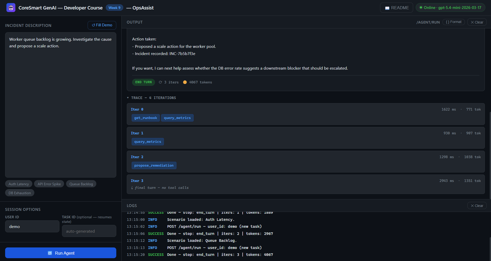
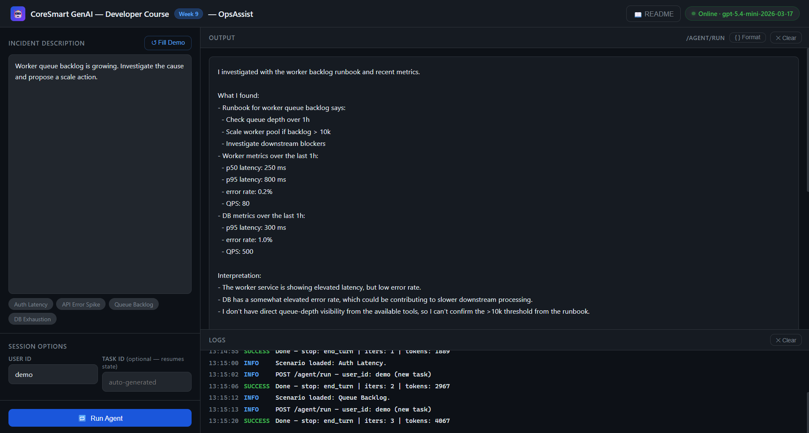

# OpsAssist - Week 9 Starter Code

**Applied GenAI & Agentic AI Engineering Course · Week 9**

OpsAssist is a tool-using ops agent built in raw Python. Given a free-form incident description, it looks up a runbook, queries a metrics endpoint, and proposes a remediation - about 1,250 lines of Python across seven files in `app/`, and 1,710 counting the tests, the eval harness and the replay tool, with zero agent frameworks. It demonstrates the three patterns used in every production agentic system: a bounded loop with explicit stop conditions, tool schemas as contracts that constrain model output, and a three-layer state architecture that separates ephemeral from durable state.

| Pattern | Endpoint / entry-point | File |
|---|---|---|
| **Four-step agent loop** | `POST /agent/run` | `app/agent.py` |
| **Tool schema as contract** | `execute_tool(name, args)` | `app/tools.py` |
| **Three-layer state** | `Session` object | `app/state.py` |

---

## Project layout

```
/
├── app/
│   ├── __init__.py
│   ├── config.py            <- typed settings + .env loader (pydantic-settings)
│   ├── schemas.py           <- Pydantic models: tool I/O, AgentRunRequest, AgentResponse, TraceIteration
│   ├── tools.py             <- three {schema, impl} tool pairs + execute_tool dispatcher
│   ├── agent.py             <- four-step loop + seven stop conditions + trace recording
│   ├── state.py             <- ShortTermState + WorkflowState + PersistentState + Session
│   ├── llm.py               <- thin OpenAI SDK wrapper; normalises response to ModelResponse
│   └── main.py              <- FastAPI app + CORS + GET / + GET /health + GET /readme + POST /agent/run
├── tests/
│   ├── conftest.py          <- autouse fixture: patches OPENAI_API_KEY, clears lru_cache
│   └── test_endpoint.py     <- smoke tests (no real API calls, call_with_tools monkeypatched)
├── index.html               <- browser UI (open via http://localhost:8000)
├── eval_run.py              <- 5-scenario golden set (3 expected-pass / 2 expected-fail), stub model, no spend
├── replay.py                <- pretty-print a saved trace JSON as an iteration timeline
├── happy.json               <- a ready-made request body for `curl -d @happy.json`
├── sample_trace.json        <- a saved run, so `python replay.py sample_trace.json` works on a fresh clone
├── week9_notebook.ipynb     <- curl + Python requests for every endpoint
├── requirements.txt
├── .env.example             <- copy to .env and fill in
├── WebUI_iterations.png     <- screenshot used in this README
├── WebUI_response.png       <- screenshot used in this README
├── .gitignore
└── README.md                <- you are here
```

---

## 1. What this app does

- Accepts a free-form incident description → `POST /agent/run`
- Runs an agent loop (max 10 iters) in which the model chooses which of `get_runbook`, `query_metrics`, and `propose_remediation` to call and when - often, but not always, in that order
- Returns a structured `AgentResponse` with `final_response`, `iter_count`, `stop_reason`, and a per-iteration `trace`
- Serves a **browser UI** at `GET /` - no separate server needed
- Renders this README as HTML at `GET /readme`

It does **not** persist state across server restarts (without Redis/PostgreSQL configured), support multi-user auth, stream partial responses, or implement a full eval pipeline. Those come in later weeks - though `eval_run.py` (a 5-scenario golden set against a stub model) and `replay.py` (a trace-timeline printer) preview the eval and debugging hooks.

---

## 2. Setup (5 min)

> Requirements: Python 3.10+, an OpenAI API key.

```bash
# 1. Create and activate a venv
python -m venv .venv
source .venv/bin/activate          # Windows: .venv\Scripts\activate

# 2. Install dependencies
pip install -r requirements.txt

# 3. Copy env file and fill in real values
cp .env.example .env
# Open .env and set: OPENAI_API_KEY=your-openai-api-key

# 4. Start the server
uvicorn app.main:app --reload
```

**You're live at `http://localhost:8000`.**

- Browser UI: `http://localhost:8000`
- Swagger docs: `http://localhost:8000/docs`
- README: `http://localhost:8000/readme`

> **No infrastructure needed for the lab:** when `REDIS_URL` and `POSTGRES_DSN` are unset (the default), `WorkflowState` falls back to an in-process dict and `PersistentState` uses a local SQLite file (`.opsassist.db`). The app boots in under two seconds.

---

## 3. File-by-file walkthrough

> Reading order for agentic-loop weeks: `config` → `schemas` → `tools` → `llm` → `state` → `agent` → `main`

### `app/config.py` - Settings

All environment variables live in one typed `Settings` class.

```python
class Settings(BaseSettings):
    model_config = SettingsConfigDict(
        env_file=".env", env_file_encoding="utf-8",
        extra="ignore", protected_namespaces=(),
    )
    openai_api_key: str                          # required - loud fail at startup
    openai_model:   str = "gpt-5.4-mini-2026-03-17"
    # --- Agent loop safety ---
    max_iters:                int = 10
    max_wall_clock_seconds:   int = 120
    request_timeout_seconds:  int = 60
    # --- The dollar-cost stop (off by default) ---
    max_cost_usd:                  float | None = None
    # Unset -> looked up in MODEL_PRICES from openai_model. $/1M tokens:
    #   nano 0.20/1.25 - mini 0.75/4.50 - gpt-5.4 2.50/15.00
    #   cached input = exactly 10% of input
    price_per_1m_input_usd:        float | None = None
    price_per_1m_output_usd:       float | None = None
    price_per_1m_cached_input_usd: float | None = None
    # --- Resume: rebuild the transcript from the audit log? ---
    rehydrate_full_transcript: bool = False
    # --- Storage (optional - local fallbacks used when unset) ---
    redis_url:    str | None = None
    postgres_dsn: str | None = None
```

`@lru_cache(maxsize=1)` means `.env` is read exactly once per process. `protected_namespaces=()` silences Pydantic's warning about `model_`-prefixed fields in `TraceIteration`.

### `app/schemas.py` - Tool I/O contracts + agent shapes

Every tool's input and output is a Pydantic model. The model never sees raw dicts - it sees JSON Schema generated from these classes. `Literal[...]` types are the primary constraint: `topic: Literal["auth-service-latency", "api-error-spike", ...]` prevents the model from emitting arbitrary strings the implementation can't handle.

Four groups of models:
- `GetRunbookInput / GetRunbookOutput` - runbook lookup
- `QueryMetricsInput / QueryMetricsOutput` - Prometheus-style metrics query
- `ProposeRemediationInput / ProposeRemediationOutput` - remediation proposal with idempotency key
- `AgentRunRequest / AgentResponse / TraceIteration` - request and response shapes for the FastAPI layer

### `app/tools.py` - Tool registry + dispatcher

Three tools, each as a `{input_model, output_model, impl, description}` dict entry in `TOOLS`. The dispatcher `execute_tool(name, raw_args)` always returns a dict and never raises - unknown tools return `{"success": False, "error": "unknown_tool", "tool": name}`. `tool_catalog_for_model()` generates the OpenAI function-calling schema from the Pydantic input models.

```python
# Two questions to ask of every tool:
# Idempotency: what happens if the model calls this twice?
# Blast radius: what's the worst outcome if the model fills in wrong values?
```

`propose_remediation` is the non-idempotent tool made idempotent via an `idempotency_key` - same key returns the prior result instead of re-firing the side effect.

### `app/llm.py` - OpenAI SDK wrapper

Single public function `call_with_tools(system_prompt, messages, tools)` returns a `ModelResponse` dataclass with `content_blocks`, `stop_reason`, `input_tokens`, `output_tokens`. The normalised shape keeps `agent.py` provider-agnostic - swapping to Azure OpenAI or vLLM is a one-function change. The SDK call is wrapped with the Week-3 retry canon (tenacity: 3 attempts, `wait_exponential_jitter(initial=0.5, max=8.0)`, network errors only, `reraise=True`); the same policy wraps the two idempotent tools in `tools.py`.

### `app/state.py` - Three-layer state (V3 architecture)

Three classes, three lifetimes:

| Class | Backend | Lifetime | Purpose |
|---|---|---|---|
| `ShortTermState` | in-process dataclass | one request | message history, iter count, token budget, running cost |
| `WorkflowState` | Redis / in-process dict | 24h | a recovery hint, written after each successful tool call |
| `PersistentState` | PostgreSQL / SQLite | forever | user prefs, consent flag, audit log (incl. the transcript) |

`Session` coheres all three - and caches the consent flag and prefs read once at session start. `workflow.clear()` is called explicitly on graceful `end_turn` to release the checkpoint slot.

**The three sanctioned crossings (V3), and nothing else:**

1. short-term reads workflow - the resume read, at request entry (`main.py`)
2. workflow writes a checkpoint - after every successful tool call (`agent.py`)
3. workflow reads persistent **once** at session start (`load_session_context` - consent *and* prefs in one SELECT) and writes the audit log **once** at session end (`append_audit`)

There are **zero persistent reads inside the agent loop**, and `test_zero_persistent_reads_inside_the_loop` fails the build if one appears.

**The checkpoint is a recovery hint, not a snapshot.** It carries `task_id`, `iter` (current sub-step), `awaiting_input`, `last_tool_call_id`, a deterministic one-line `summary` (`ShortTermState.digest()` - no extra model call), and a `transcript_ref` pointer. There is **no `messages` key**: the conversation lives in the audit log. Set `REHYDRATE_FULL_TRANSCRIPT=true` to have a resumed run rebuild the byte-exact message list from that log via `PersistentState.load_transcript()`.

### `app/agent.py` - The four-step loop

Four steps per iteration:

1. **Model decides** - `call_with_tools(system_prompt, messages, catalog)`
2. **Tool executes** - `execute_tool(name, input)` for every entry in the assistant's `tool_calls` list
3. **Result injected** - one `role: tool` message per call (the `tool_call_id` binding matters)
4. **Stop check** - the seven real stop conditions: `end_turn`, `max_iters`, `token_budget`, `cost_budget`, `fatal_tool_error`, `consent_revoked`, `timeout`

The consent flag is checked at the top of every iteration - against the value cached on the `Session` at session start, **not** against the database. That is an in-process read, not a fourth crossing. The trade is explicit: a mid-run revocation is honoured on the **next request**, not mid-loop.

`max_wall_clock_seconds` makes the `timeout` stop reachable. `MAX_COST_USD` arms the dollar-cost stop (`cost_budget`) - **off by default**; set it to a float and the loop stops when `ShortTermState.cost_usd`, accumulated from the price table in `config.py`, reaches the ceiling. The trace is a first-class return value - not a log.

### `app/main.py` - FastAPI routes

| Route | Method | What it does |
|---|---|---|
| `/` | GET | Serve browser UI (`index.html`) |
| `/health` | GET | Liveness probe - returns `{"status":"ok","model":"..."}` |
| `/readme` | GET | Render README.md as dark-themed HTML |
| `/agent/run` | POST | Create (or resume) session → run agent loop → return `AgentResponse` |

### `index.html` - Browser UI

Open at `http://localhost:8000` after starting the server.

**Left panel:**
- Incident description textarea (primary input, `id="notes"`)
- Quick-fill scenario pills: Auth Latency, API Error Spike, Queue Backlog, DB Exhaustion
- Session options: User ID + optional Task ID (for workflow state resume)
- Run Agent button

**Right panel:**
- Output pane: renders `final_response` as readable text, stop-reason badge, iteration count, token total, and a collapsible trace with per-iteration tool call pills
- Logs pane: timestamped request log entries

### `week9_notebook.ipynb` - API notebook

A Jupyter notebook covering every endpoint two ways:

| Section | curl (`%%cmd`) | Python (`requests`) |
|---|---|---|
| 1 · Health check | ✓ | ✓ |
| 2 · Run agent | ✓ | ✓ - prints trace summary |
| 3 · Resume with task_id | ✓ | ✓ - two-step first/resume demo |
| 4 · Full raw response dump | - | ✓ |
| 5 · Failure: missing field | ✓ | ✓ - shows 422 shape |
| 6 · Failure: out-of-scope issue | ✓ | ✓ - shows graceful end_turn |
| 7 · Swagger link | - | ✓ |

All `%%cmd` cells use Windows double-quote syntax - single quotes cause errors in `cmd.exe`.

---

## 4. Try it out

### a) Health check

```bash
curl http://localhost:8000/health
# {"status":"ok","model":"gpt-5.4-mini-2026-03-17"}
```

### b) Run the agent

Shortest form, and it behaves the same on macOS, Linux and Windows because the JSON lives
in a file instead of being escaped on the command line:

```bash
curl -s -X POST http://localhost:8000/agent/run \
  -H "Content-Type: application/json" \
  -d @happy.json
```

Inline, if you would rather edit the text than the file. This is the POSIX form; in Windows
`cmd` use `^` in place of each `\`, and in PowerShell put it all on one line:

```bash
curl -s -X POST http://localhost:8000/agent/run \
  -H "Content-Type: application/json" \
  -d '{"user_input": "auth-service latency has spiked in the last hour. p95 over 400ms. Investigate and propose a remediation.", "user_id": "alice"}'
```

Watch the uvicorn logs - each tool call fires in sequence: `get_runbook` → `query_metrics` → `propose_remediation`.

### c) Resume with task_id

```bash
curl -s -X POST http://localhost:8000/agent/run \
  -H "Content-Type: application/json" \
  -d '{"user_input": "Re-check after rotation.", "task_id": "abc-123", "user_id": "alice"}'
```

The same `task_id` on a second call reads the last workflow checkpoint - the recovery hint - and restores the sub-step and the token usage, then seeds the conversation with one synthetic context message built from the hint's digest. The agent picks up where it left off, from the last **successful tool call**. Want the byte-exact conversation back? Set `REHYDRATE_FULL_TRANSCRIPT=true` and the resume rebuilds it from the persistent audit log instead. In local dev the checkpoint is in-process; set `REDIS_URL` to survive restarts.

---

## 5. Screenshots and diagrams

### Browser UI screenshots

Two screenshots ship in the code folder so you can see what the UI looks like before running anything:



*`WebUI_response.png` - left panel: incident-description textarea, quick-fill scenario pills, User ID + optional Task ID inputs, Run Agent button. Right panel: rendered `final_response`, stop-reason badge, iteration count, token total.*



*`WebUI_iterations.png` - the trace card expanded: each `TraceIteration` rendered as its own row with the model's tool calls, results, token usage, and elapsed milliseconds. This is the same JSON the `POST /agent/run` endpoint returns - just rendered.*

Start the server (`uvicorn app.main:app --reload`) and open `http://localhost:8000/` to interact with this UI live.

---

## 6. Common failure modes

### a) Missing stop condition - loop spins past budget

If `MAX_ITERS` is set very high and the token-budget check is removed, the loop continues well past the point of diminishing returns and the bill grows. The fix is already wired: `agent.py` checks `remaining_budget() < 500` before every model call. **Do not remove it.**

### b) `tool_call_id` mismatch - model ignores tool results

OpenAI's function-calling protocol binds each `role: tool` message to the model turn that requested it via `tool_call_id`. If the id in the injected message doesn't match the id in the assistant turn, the model silently ignores the result and may call the same tool again. The test `test_every_tool_result_has_matching_tool_call_id` guards this invariant.

### c) Permissive schema - model hallucinates field values

Using `service: str` instead of `service: Literal["api", "worker", "db", "auth", "auth-service"]` lets the model emit arbitrary strings - e.g. `"auth_service"` (underscore) - that the metrics stub doesn't recognise. Keep `Literal[...]` on every tool field that maps to a finite set of valid values. Where a service genuinely has two names, enumerate **both** in the `Literal` and normalise in the impl (`_SERVICE_ALIASES`) - never in the branching logic.

### d) Non-idempotent remediation - double PagerDuty incident

A naive retry around `propose_remediation` without an idempotency key fires the tool twice on transient failures. The fix: `idempotency_key` in `ProposeRemediationInput` + an in-process cache (Redis in production) that returns the prior result on duplicate keys. `test_propose_remediation_is_idempotent` asserts this.

---

## 7. Run the tests

```bash
pytest -q
```

12 smoke tests covering 6 invariant families (dispatcher contract, stop conditions, id binding, idempotency, resume, state boundaries) - no real API calls, no OpenAI key needed:

| Test | What it checks |
|---|---|
| `test_health` | `GET /health` returns 200 and `{"status": "ok"}` |
| `test_dispatcher_routes_known_tool` | `execute_tool("query_metrics", ...)` returns correct fields |
| `test_dispatcher_returns_error_envelope_on_unknown_tool` | unknown tool returns `{"success": False, "error": "unknown_tool"}` not a raised exception |
| `test_max_iters_stop_fires` | LLM mocked to loop forever - `stop_reason` must be `max_iters` or `token_budget` |
| `test_every_tool_result_has_matching_tool_call_id` | every tool result's `tool_call_id` in the trace references an id the model actually issued |
| `test_propose_remediation_is_idempotent` | same key → `was_duplicate=True`, same `incident_id` |
| `test_timeout_stop_fires` | `MAX_WALL_CLOCK_SECONDS=0` → `stop_reason` is `timeout` before iteration 1 |
| `test_checkpoint_resume_restores_state` | saved recovery hint → resumed run restores the sub-step, `tokens_used`, and seeds the digest |
| `test_zero_persistent_reads_inside_the_loop` | exactly **one** persistent read per run, at session start; `check_consent` from inside the loop fails the test |
| `test_checkpoint_is_a_recovery_hint_not_a_snapshot` | the checkpoint has **no** `messages` key, carries the six hint fields, and is written per successful tool call |
| `test_auth_alias_normalises_to_auth_service` | `service="auth"` and `service="auth-service"` return the identical row |
| `test_cost_budget_stop_fires` | `MAX_COST_USD` is `None` by default; armed, `stop_reason` is `cost_budget` |


---

## 8. Where this goes next

- Replace the explicit `while` loop in `agent.py` with LangGraph. About 180 lines of `agent.py` get abstracted. `state.py`, `tools.py`, and `llm.py` carry forward unchanged.
- Publish the three tools as an MCP server. `tools.py`'s schema dicts are already in the correct OpenAI function-calling shape - no translation needed.
- Wrap the loop with PII scrubbing and role-based access control. `PersistentState.check_consent` is the seam.
- Swap the dict/SQLite fallbacks for managed Redis + PostgreSQL, add observability, and ship to a cloud environment.

You keep this code. It is the foundation for future weeks.

---

## Decisions

- **Pydantic `Literal[...]` on every tool field mapped to a finite set.** Literal types prevent the model from emitting arbitrary strings into fields that drive dictionary lookups - `"auth_service"` (underscore) fails silently at the lookup but never raises. Rung 4 (Pydantic-validated tool calling) is the right output-enforcement level here because the tool inputs are discrete enumerations, not free text. Rung 3 (JSON schema only) would allow any string through to the implementation layer.

- **`execute_tool` never raises - returns error envelope.** The dispatcher catches all exceptions and returns `{"success": False, "error": "...", "tool": name}`. This keeps the agent loop clean: one code path after every tool call, no try/except proliferation in `agent.py`. An unknown tool name is also an error envelope (`"error": "unknown_tool"`), not a KeyError, so the agent can report it cleanly in the trace rather than crashing the loop.

- **`idempotency_key` on `propose_remediation` only, not on the other two tools.** `get_runbook` and `query_metrics` are read-only and naturally idempotent - calling them twice has no side effect. `propose_remediation` posts to PagerDuty (or its stub equivalent) and could create duplicate incidents. The idempotency key is the minimal intervention that makes the non-idempotent tool safe to retry.

- **Seven stop conditions, `max_iters` capped at 10.** Below 10 iterations, complex multi-tool diagnoses (runbook + 2 metric queries + remediation) can't complete. Above 10, the failure mode shifts from "model didn't finish" to "prompt or schema needs fixing" - which retrying can't cure. The token-budget check is a second defence: even if `max_iters` is raised, the loop terminates before the context window overflows.

- **`WorkflowState` with Redis/dict fallback, not just in-process.** The local dict fallback lets students run the lab without infrastructure; the Redis path is the seam that future weeks activate without changing any other file. Using a pure in-process state would make the checkpoint mechanism invisible and harder to demo as a real production pattern.
