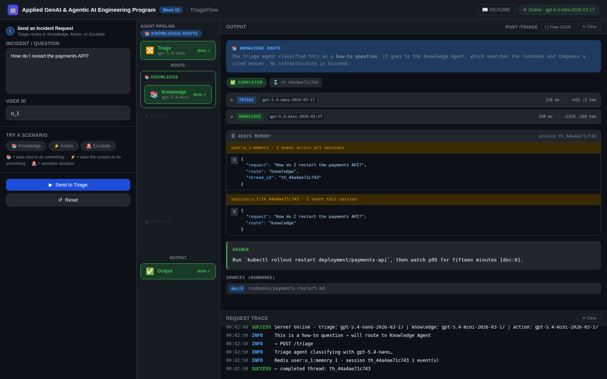
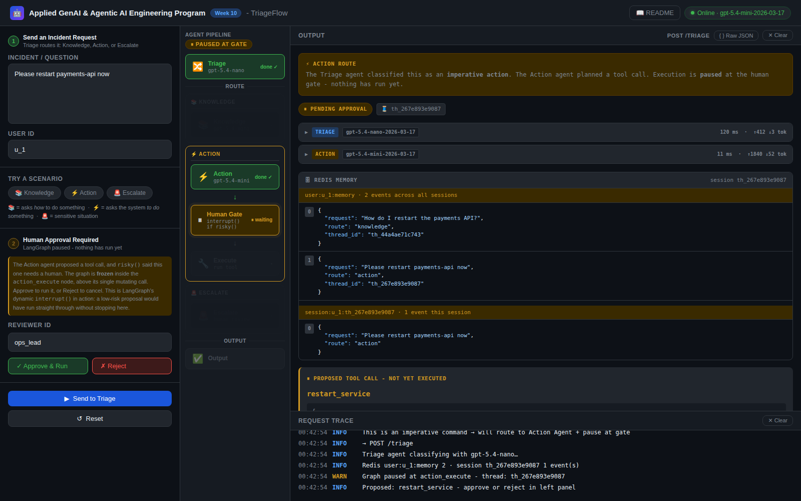
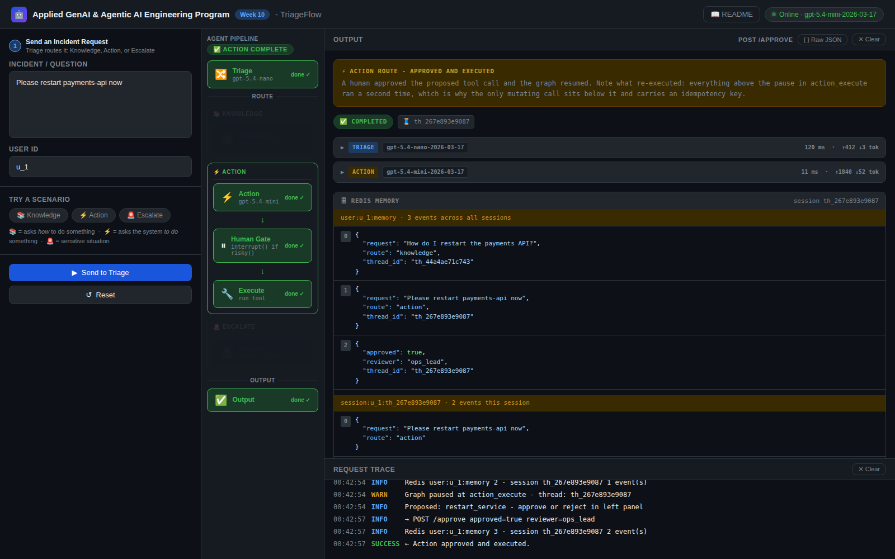
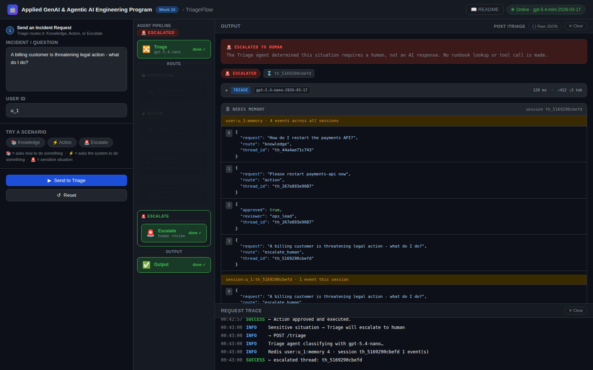
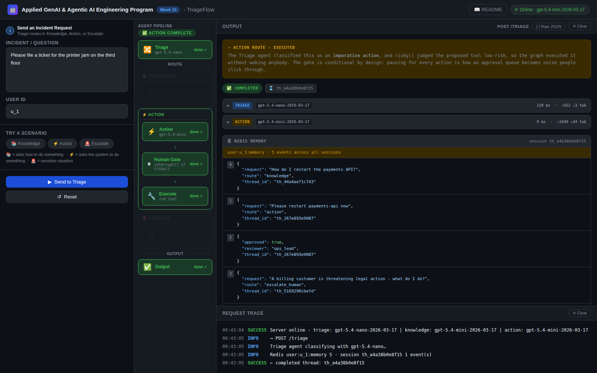

# TriageFlow - Week 10 Live Code

**Applied GenAI & Agentic AI Engineering Program · Week 10**

TriageFlow is a three-agent LangGraph system that routes incoming IT incidents through a Triage classifier, a Knowledge agent (grounded on runbooks), and an Action agent that proposes infrastructure changes - with a human-in-the-loop approval gate before anything runs. It demonstrates the production patterns every multi-agent system must implement: explicit handoff contracts, four-layer memory scoped per user, and safe human approval before mutations.

| Pattern | Endpoint / entry-point | File |
|---|---|---|
| **Multi-agent routing + handoff contracts** | `POST /triage` | `app/graph.py` |
| **Four memory layers (session, external, episodic, procedural)** | `POST /triage` | `app/memory.py` |
| **Human approval gate - interrupt / resume** | `POST /triage` → `POST /approve` | `app/main.py` |

---

## 1. Project layout

```
/
├── app/
│   ├── __init__.py
│   ├── config.py            ← typed settings + .env loader (pydantic-settings)
│   ├── schemas.py           ← Pydantic API models + TriageState TypedDict (handoff contract)
│   ├── tools.py             ← restart_service / page_team / file_ticket: schemas + mock impls
│   ├── llm.py               ← thin OpenAI wrapper (chat completions) with retry + structured logging
│   ├── memory.py            ← four memory layers + memory_write(scope, kind, payload): the single scoped write path
│   ├── vectorstore.py       ← the vector store: in-process cosine index (default) or real pgvector. No Docker either way
│   ├── state.py             ← assert_handoff / assert_retrieved: the entry assertions, presence not truthiness
│   ├── risk.py              ← risky(proposal): the pause policy this codebase owns, pure and unit-tested
│   ├── authz.py             ← who is calling and what they may touch: thread ownership vs the approver role
│   ├── graph.py             ← LangGraph StateGraph: 3 agent nodes + conditional edges + a dynamic interrupt() gate
│   └── main.py              ← FastAPI routes: /triage, /approve, /prefs, /user/{id} (DELETE), /session/{thread_id}, /health, / (UI), /readme
├── prompts/                 ← git-versioned agent system prompts (one .txt file per agent)
│   ├── __init__.py          ← prompt loader + compose_system_prompt (folds in procedural memory)
│   ├── triage.txt           ← routing classifier prompt (outputs one word)
│   ├── knowledge.txt        ← grounded QA with citation instructions
│   └── action.txt           ← tool proposal generation prompt
├── tests/
│   └── test_endpoint.py     ← smoke + contract + memory + gate + authz tests (47), stubbed LLM + Redis, runs offline in ~3 s
├── week10_notebook.ipynb    ← /health, /triage and /approve in both curl and Python, plus two offline failure demos
├── requirements.txt
├── .env.example             ← copy to .env and fill in OPENAI_API_KEY
├── .gitignore
└── README.md                ← you are here
```

---

## 2. What this app does

- Routes an incident to the right agent (Knowledge, Action, or Escalate) → `POST /triage`
- Answers grounded knowledge questions with runbook citations → `POST /triage` (knowledge route)
- Proposes infrastructure tool calls, pauses for human approval, then executes → `POST /triage` + `POST /approve`
- Renders the README as dark-themed HTML → `GET /readme`
- Reports live model versions → `GET /health`

- Writes a procedural-memory preference → `POST /prefs`
- Erases a user from all four memory layers and returns a receipt → `DELETE /user/{user_id}`

**Session memory is the one real backend, Redis; external, episodic and procedural ship as production-shaped stubs - now with all four wired.** Redis degrades gracefully with a logged warning if it isn't running. The vector-store layers (`search_runbooks`, `search_episodic`) are real vector search - embeddings, cosine top-k and a `(scope, collection)` metadata filter - over a canned corpus, in process by default. Set `MEMORY_BACKEND=pgvector` and the same call sites hit a real PostgreSQL with the `vector` extension. No Docker either way.

---

## 3. Setup (5 min)

> Requirements: Python 3.10+, OpenAI API key.

```bash
# 1. Create and activate a venv
python -m venv .venv
source .venv/bin/activate          # Windows: .venv\Scripts\activate

# 2. Install dependencies
pip install -r requirements.txt

# 3. Copy env file and fill in
cp .env.example .env
# Open .env - set OPENAI_API_KEY=sk-...

# 4. (Optional) Redis for live session memory. Without it, session memory is
#    skipped with a warning; everything else still runs.
docker run -d --name tf-redis -p 6379:6379 redis:7   # or any Redis you already have

# 4b. (Optional) The real Postgres + pgvector backend - NO DOCKER.
#     pgserver ships PostgreSQL 16.2 and the pgvector extension inside the wheel.
pip install -r requirements-pgvector.txt
export MEMORY_BACKEND=pgvector    # Windows: $env:MEMORY_BACKEND="pgvector"

# 5. Start the server
uvicorn app.main:app --reload --port 8000
```

**You're live at `http://localhost:8000`.**

- Swagger docs: `http://localhost:8000/docs`
- README rendered: `http://localhost:8000/readme`

> **Redis and Postgres are optional for the demo.** If unavailable, `session_append` and `session_read` fail gracefully with a logged warning. The graph routing, approval gate, and all LLM calls work without them.

> **Redis is optional - run with it or without it.** Leave `REDIS_URL` unset and the app still works; `session_append`/`session_read` just log a warning and session memory is not retained between turns. To keep memory across turns, point `REDIS_URL` at any Redis instance - local (`redis://localhost:6379/0`) or a hosted one. Put credentials only in your local `.env`; never commit them.

> **LangSmith tracing (optional).** Uncomment `LANGSMITH_TRACING=true` in `.env` and set `LANGSMITH_API_KEY` - every node, prompt, latency, and token count then renders as a waterfall trace under the `triageflow` project (used for the V3 trace demo). Leave it commented out and nothing is sent anywhere.

---

## 4. File-by-file walkthrough

Reading order: `config → schemas → tools → llm → memory → graph → main → prompts/`

### `app/config.py` - Settings

All env access goes through a single `Settings` class. Two reasons:
1. Reading `os.environ["KEY"]` from random places is how secrets end up in logs.
2. `pydantic-settings` validates types on startup - a missing key fails loudly before the first request.

Two model fields intentionally use different tiers:

```python
# PINNED model versions - never use *-latest in production code.
triage_model: str = "gpt-5.4-nano-2026-03-17"
knowledge_model: str = "gpt-5.4-mini-2026-03-17"
```

(`pydantic-settings` maps the env vars `TRIAGE_MODEL` / `KNOWLEDGE_MODEL` onto these attributes automatically.)

Triage only outputs one word - the fast/cheap model is correct there. The knowledge and action agents write full answers, so they get the more capable model. This is cost routing at the config layer.

### `app/schemas.py` - API contracts + handoff contract

Two types live here:

**Pydantic models** (`TriageRequest`, `TriageResponse`, `ApproveRequest`) - API boundary validation. FastAPI rejects bad requests with 422 before any LLM call is made.

**`TriageState` TypedDict** - the handoff contract between graph nodes. Every field is annotated with which node writes it. `total=False` means no field is required at construction - the state starts empty and fills as nodes run. This explicit contract is the most important design choice in the project: without it, a missing key produces a silent wrong answer instead of a loud, locatable failure.

### `app/tools.py` - Tool schema + mock implementations

Three tools: `restart_service`, `page_team`, `file_ticket`. All mocked (they log and return fake JSON).

**Key design:** the Action agent reads the tool schemas and proposes a call as JSON. It never executes. Execution only happens inside `action_execute_node` - after a human has approved. Two questions to ask of every tool:
- **Idempotency** - what happens if the model calls this twice?
- **Blast radius** - what's the worst outcome if the model fills in wrong values?

### `app/llm.py` - Thin OpenAI wrapper

One module owns all LLM calls. The signature `call(model, system, messages)` is provider-agnostic. OpenAI's system prompt is prepended here as `{"role": "system"}` - callers just pass a string.

Retries are handled by **tenacity**: 3 attempts on `APIConnectionError` / `RateLimitError` / `InternalServerError`, exponential backoff with jitter (0.5 s → 8 s cap), then reraise. A node-level `RetryPolicy(max_attempts=3)` in `graph.py` catches anything that escapes. `LLMResult` captures latency and token counts - logged on every call.

### `app/memory.py` - Four memory layers

| Layer | Backend | Scope | TTL | Function |
|---|---|---|---|---|
| Session | Redis (real) | key `session:{user_id}:{thread_id}` | 1 h | `session_append`, `session_read`, `session_clear_for_user` |
| External | vector store | `global` / `runbooks` | forever | `search_runbooks` |
| Episodic | vector store | `user:{uid}` / `episodic` | forever | `search_episodic`, `write_episodic_summary` |
| Procedural | in-process dict standing in for a Postgres JSONB row | `user:{uid}` | forever | `get_prefs`, `set_pref`, `seed_demo_prefs` |

**Every write goes through one helper.** `memory_write(scope, kind, payload)` is the single write path into all four layers. It asserts the scope - `"global"` or `f"user:{uid}"` - and dispatches to the layer's own writer. Every read passes the same scope back as a metadata filter. Multi-tenant leaks are silent failures; one choke point is the only thing that catches them.

**The vector store is real, and it has two backends behind one interface** (`app/vectorstore.py`):

| `MEMORY_BACKEND` | What runs | Needs |
|---|---|---|
| `memory` *(default)* | In-process cosine index: deterministic offline embeddings, cosine top-k, `(scope, collection)` metadata filter | nothing |
| `pgvector` | Real PostgreSQL 16 + the `vector` extension + an HNSW index, from a pip-installed embedded binary | `pip install -r requirements-pgvector.txt` |

Neither needs Docker. The corpus is canned - five runbook chunks and a few per-user incident summaries - but the retrieval is not. The same test suite passes against both backends.

**GDPR delete path:** `DELETE /user/{user_id}` calls all four and returns a receipt with four counters. `delete_user_long_term` wipes episodic and user-scoped external memory. `delete_prefs` clears procedural. Session keys are deleted on demand by `session_clear_for_user`, which `SCAN`s `session:{user_id}:*` (the user_id is in the key schema precisely so this scan can match - and `SCAN`, never `KEYS`, because `KEYS` blocks Redis); the 1 h TTL is a backstop, not the deletion path. All four paths must be exercised for a complete right-to-be-forgotten response.

The global runbook corpus is scoped `global`, not `user:{uid}` - so a user deletion cannot touch it. That is the scope filter earning its keep in the other direction.

### `app/graph.py` - LangGraph StateGraph

Five nodes wired with edges and one conditional branch:

```
START → triage → [route_after_triage] → knowledge → compose → END
                                      → action → action_execute → compose → END
                                      → compose → END  (escalation path)
```

The approval gate is a **dynamic `interrupt()` call inside `action_execute_node`**, not a compile-time `interrupt_before` list. The difference is conditionality: a compile-time list cannot express a condition, so every visit to the node wakes a human, including the one that files a ticket about a printer jam. `risky(proposal)` is a pure function this codebase owns and unit-tests, and it decides. `/approve` resumes with `Command(resume={...})`, so the reviewer's identity travels with the request instead of being written onto the shared contract.

Resuming re-runs the node from the top, which is why the single mutating call is the node's last statement, why the call below the pause carries an idempotency key derived from the thread id plus the proposal id, and why the node re-reads the resource version after the resume and refuses a plan the world has moved past.

`route_after_triage` is a conditional edge function - it reads `state["route"]` and returns a **route literal**, never a node name; the edge map does the mapping. If the model returns an unexpected value it falls back to `"escalate_human"` with a warning. The fallback is the least consequential branch rather than the cheapest one: answering an unroutable incident with a runbook paragraph is worse than admitting the system does not know.

### `app/main.py` - FastAPI routes

| Route | Method | What it does |
|---|---|---|
| `/triage` | POST | Run the graph; return final answer or pending approval |
| `/approve` | POST | Resume a paused thread with approve/reject decision |
| `/prefs` | POST | Write a procedural-memory preference through the scoped helper |
| `/user/{user_id}` | DELETE | GDPR erasure across all four memory layers; returns a four-counter receipt |
| `/session/{thread_id}` | GET | Return the Redis session events for a thread - consumed by `index.html` to show memory state |
| `/health` | GET | Liveness probe - `{"status":"ok","model":"...","models":{...}}` |
| `/` | GET | Serve the `index.html` demo UI |
| `/readme` | GET | Render README.md as dark-themed HTML |

`/approve` validates that the thread is actually paused at `action_execute` before injecting state. Without that check, a reviewer could call approve on any thread ID and the graph would silently accept it - or produce a deadlocked thread that waits forever.

### `prompts/` - Git-versioned agent prompts

Each agent's system prompt is a `.txt` file. Not an inline f-string, not a constant buried in a function.

Why files? `git diff prompts/triage.txt` shows exactly what changed between versions. Future week adds a test suite that runs against these files on every commit. Keeping prompts in code makes that impossible.

`compose_system_prompt` in `prompts/__init__.py` appends the user's procedural memory rules at runtime - personalisation without coupling the prompt file to any user.

### `week10_notebook.ipynb` - API notebook

Covers every endpoint two ways (curl and Python `requests`):

| Section | curl (`%%cmd`, Windows) | Python |
|---|---|---|
| Health check | ✓ | ✓ |
| Knowledge route (`POST /triage`) | ✓ | ✓ |
| Action route + approve | ✓ | ✓ |
| Failure: missing field (422) | ✓ | ✓ |
| Failure: approve unknown thread (409) | ✓ | ✓ |
| Failure: empty request (422) | - | ✓ |
| Swagger link | - | ✓ |

---

## 5. Try it out

### a) Health check

```bash
curl http://localhost:8000/health
# {"status":"ok","model":"gpt-5.4-mini-2026-03-17","models":{"triage":"gpt-5.4-nano-2026-03-17","knowledge":"gpt-5.4-mini-2026-03-17"}}
```

### b) Knowledge route - how-to question

```bash
curl -X POST http://localhost:8000/triage ^
  -H "Content-Type: application/json" ^
  -H "X-User-Id: u_1" ^
  -d "{\"user_request\": \"How do I restart the payments API?\", \"user_id\": \"u_1\"}"
```

`u_1` is the seeded demo user - prior incidents and procedural rules both exist for that id, and
any other id gives you an empty memory panel. `X-User-Id` is the caller. Every endpoint but `/health` requires it, and the server refuses a
`user_id` in the body that does not match it - see section 5d.


Expected: `status: completed`, `final_answer` with `[doc:0]` citation marker, `citations` array.

### c) Action route - imperative request, then approve

```bash
# Step 1: trigger the action route - graph pauses at the approval gate
curl -X POST http://localhost:8000/triage ^
  -H "Content-Type: application/json" ^
  -H "X-User-Id: u_1" ^
  -d "{\"user_request\": \"Please restart payments-api now\", \"user_id\": \"u_1\"}"
# Expected: status: pending_approval, proposed_action: {tool_name: restart_service, ...}

# Step 2: approve - capture thread_id from Step 1 and replace th_xxx below
# Note the caller: the APPROVER, not the requester. That is the point of a gate.
curl -X POST http://localhost:8000/approve ^
  -H "Content-Type: application/json" ^
  -H "X-User-Id: ops_lead" ^
  -d "{\"thread_id\": \"th_xxx\", \"approved\": true, \"reviewer_id\": \"ops_lead\"}"
# Expected: status: completed, final_answer: Action complete: restart_service -> ...
```

Try it as the wrong person and watch what comes back:

```bash
# u_1 approving their own request: 403. Approval is a role, not a self-service button.
curl -X POST http://localhost:8000/approve ^
  -H "Content-Type: application/json" -H "X-User-Id: u_1" ^
  -d "{\"thread_id\": \"th_xxx\", \"approved\": true, \"reviewer_id\": \"u_1\"}"

# somebody else reading u_1's memory from a thread id: 404, not 403.
# A 403 would confirm the thread exists, which is what an enumeration attack wants.
curl http://localhost:8000/session/th_xxx -H "X-User-Id: u_99"
```

### d) Who is allowed to do what

This is the part of the package that argues Week 10's thesis rather than describing it. `app/authz.py`
holds two authorities and they are deliberately different:

| Authority | Who has it | What it permits |
|---|---|---|
| **Ownership** | the user who started the thread | resume it, read its session bundle, see its prompt log |
| **Approval** | anyone in `APPROVER_IDS` | approve or reject a gated action, and nothing else |

Collapsing those into one check is how an approval queue becomes a data-export endpoint: an approver
is authorised to **decide**, and `llm_calls` is a verbatim copy of what a different person typed, so
the `/approve` response does not carry it.

`X-User-Id` is **not authentication**. It is a header, and a client can send anything. It stands in
for the one line you replace in production, where the caller comes out of a validated token. Everything
around that line - the authorization checks - is the part people leave out even when they do have real
authentication, and it is the part that does not change when you swap the header for a token.

---

## 6. Browser UI

Open `http://localhost:8000` while the server is running. The three routes produce distinct pipeline states:

**Knowledge route** - how-to question answered with runbook citations.



**Action route - Pending Approval** - `risky()` returned True and the graph paused at the `interrupt()` inside `action_execute`; Approve / Reject buttons appear.



**Action route - Completed** - reviewer approved; tool executed, pipeline fully green.



**Escalate route** - Triage classified the request as too sensitive for autonomous action. One model
call, no retrieval, no tool: the cheapest path this system has is the one where it declines to help.



**Action route - Executed without pausing** - the same node, the same run, a different verdict from
`risky()`. Filing a ticket is low-risk, so the graph executed it and woke nobody. Compare this against
the pending-approval shot above: that is the whole argument for a conditional gate.



All five were captured from a real run against this package, with Redis running, so the memory panel
shows the live key schema rather than a mock.

---

## 7. Diagrams

| File | What it shows |
|---|---|
| `triageflow_runtime_architecture.svg` | Full runtime layout: three agents, four memory layers, approval gate |
| `langgraph_state_schema.svg` | `TriageState` TypedDict fields annotated by which node writes each one |
| `approval_gate_interrupt_resume.svg` | The interrupt/resume sequence: `/triage` → pause → `/approve` → resume |
| `memory_read_write_during_run.svg` | Which memory layer is read/written at each node |

---

## 8. Common failure modes

### a) Circular handoff (recursion limit)

Break `route_after_triage` to return `"triage"` unconditionally, then call `POST /triage`. The graph runs triage → triage → triage until the recursion limit fires with a "graph exhausted" error. (LangGraph's default is **25**; we pass `recursion_limit=10` in the invoke config - see `_config()` in `main.py` - because more than 10 hops through a routing graph this small means a loop.) Fix: restore the mapping. Teaches: routing bugs are not caught by unit tests of individual nodes - you need integration tests that exercise the full graph.

### b) Missing memory key (silent wrong answer)

Comment out the `"retrieved_docs"` write in `knowledge_node`, then call `/triage` with a knowledge question. The failure now fires **loudly**: `assert_handoff` at the Compose entry raises `ValueError: handoff to compose missing fields: retrieved_docs` instead of returning a silent uncited answer. The guard lives in `app/state.py`, is called at the knowledge/action/compose entries, and is pinned by the contract tests. Fix: restore the write.

### c) Deadlocked approval (409 Conflict)

Call `POST /approve` with a `thread_id` that is not paused at the action gate. The server returns `409 Conflict`. Without this check the thread would sit at the gate forever - no error, no timeout. The validation in `main.py:approve` prevents it.

---

## 9. Run the tests

```bash
pytest -q
```

12 tests - smoke + contract, no real API calls, no Redis, no OpenAI.

| Test | What it checks |
|---|---|
| `test_health` | `GET /health` returns 200, `status: ok`, and a `model` field for the health chip |
| `test_knowledge_route` | How-to question routes to knowledge, answer contains `[doc:0]` |
| `test_citations_parsed_from_answer` | Only docs actually cited via `[doc:N]` markers become citations |
| `test_action_route_pauses_for_approval` | Imperative request routes to action, status is `pending_approval` |
| `test_approve_resumes_thread` | Approve resumes graph, final answer contains "Action complete" |
| `test_reject_declines_action` | Reject produces a "declined" final answer, no tool runs |
| `test_approve_unknown_thread_409` | Approving a non-paused thread returns 409 |
| `test_assert_handoff_raises_on_missing_field` | Contract guard raises with node name + exact missing field |
| `test_compose_fails_loudly_without_knowledge_writes` | Compose refuses a knowledge route missing upstream writes |
| `test_compose_is_single_writer_of_final_answer` | `knowledge_node` never writes `final_answer` |
| `test_session_keys_are_user_scoped` | Keys are `session:{user_id}:{thread_id}` and match the GDPR `SCAN` pattern |
| `test_runbook_search_returns_five_chunks` | The runbook corpus is five chunks; the Knowledge node takes the top 5 |
| `test_vector_search_ranks_the_right_runbook_first` | Real cosine ranking, not a list slice - the restart runbook wins the restart query |
| `test_episodic_is_scoped_to_the_user` | `u_1`'s prior incidents are invisible to `u_2`. The multi-tenant pin |
| `test_knowledge_node_retrieves_runbooks_and_prior_incidents` | Knowledge retrieves both external and episodic memory, in one node |
| `test_every_write_goes_through_the_scope_helper` | `memory_write` asserts the scope and rejects unknown kinds |
| `test_procedural_rules_reach_the_system_prompt` | Seeded prefs actually appear in the composed system prompt |
| `test_gdpr_delete_returns_four_counters` | `DELETE /user/{id}` erases all four layers and proves it |
| `test_prefs_endpoint_writes_procedural_memory` | `POST /prefs` writes through the scoped helper |

---

## 10. Where this goes next

- Wrap `knowledge_node` as an A2A-compatible FastAPI service with an Agent Card endpoint and SSE streaming. The `TriageState` TypedDict contract becomes the JSON-RPC contract on the wire.
- Add Presidio PII scrubbing on `/triage` input and on the final answer before it leaves the system.
- Build a streaming UI that renders citations, the tool trace, and the approval action button live.
- Dockerise this app, wire OpenTelemetry into `llm.py`, deploy with GitHub Actions, run eval gate before promote.
- Add regression CI over `prompts/*.txt` - frozen test set, hallucination-debugging decision tree on the Knowledge agent.
- Route between `gpt-5.4-nano-2026-03-17` and `gpt-5.4-mini-2026-03-17` dynamically based on triage confidence score.

---

## 11. Decisions

- **LangGraph over raw Python orchestration.** LangGraph gives us checkpointing, a durable `interrupt()` that can pause mid-node for hours, and typed state transitions with one import - the same three features would take 150+ lines of custom code in raw Python. The tradeoff is a framework dependency and a steeper initial learning curve; acceptable because the capstone weeks all extend this graph.
- **TypedDict for handoff state, not a Pydantic model.** LangGraph supports `TypedDict`, Pydantic models, and dataclasses as state schemas - this is a choice, not a constraint. We use Pydantic where validation pays for itself (the API boundary: `TriageRequest`, `TriageResponse`) and `TypedDict` for internal graph state, where nodes return plain dicts and per-hop validation overhead buys little. One schema style per boundary keeps node code free of model conversions.
- **Tool proposal only, no direct execution.** The Action agent outputs JSON describing what it wants to run; it never calls `execute_tool` directly. Execution happens only in `action_execute_node` after approval. This is the minimum safe boundary for infrastructure-mutating tools - one approval gate, one execution point.
- **A real vector store, two backends, no Docker.** `search_runbooks` and `search_episodic` do genuine vector search - embed the query, cosine top-k, filter on `(scope, collection)`. The default backend keeps the index in process so the lab needs no server, no network and no bill; `MEMORY_BACKEND=pgvector` swaps in real PostgreSQL + pgvector from a pip wheel, with no caller changing. The corpus is canned; the retrieval is not. That is what "production-shaped stub" is supposed to mean.
- **The in-process embedder is deterministic and dependency-free.** Hashed bag-of-words with sublinear TF and an L2 norm - not sentence-transformers, but a genuine embedding: same text, same vector; similar text, nearby vectors. It keeps the test suite offline and reproducible. Swap in a real embedding model and the store never notices.
- **One write path, not four.** Every write - session, external, episodic, procedural - goes through `memory_write(scope, kind, payload)`. A per-layer writer would be shorter; it would also give every future caller a way to forget the scope filter. The choke point is the point.
