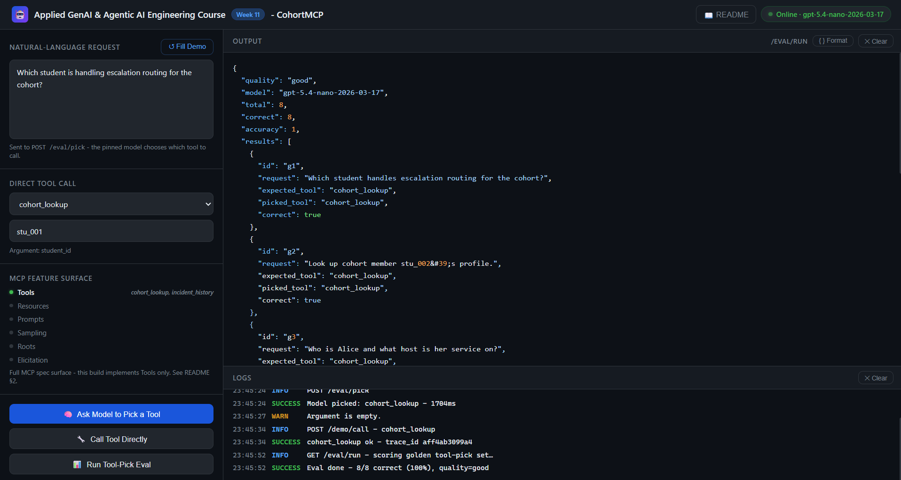

# CohortMCP - Week 11 Starter Code

**Applied GenAI & Agentic AI Engineering Course · Week 11**

CohortMCP is a standalone MCP server exposing two tools - `cohort_lookup` and `incident_history` - built on the official `mcp` Python SDK, tested, and made publishable entirely on its own. It demonstrates the full "local to consumable" arc: schema-first tool definitions, structured errors, a real stdio ↔ Streamable HTTP transport switch, and an eval harness that measures whether an LLM host actually picks the right tool - not just any tool.

| Pattern | Endpoint / entry-point | File |
|---|---|---|
| **Real MCP server (official SDK), dual transport** | `python -m app.mcp_server` (stdio default, Streamable HTTP via `MCP_SERVER_TRANSPORT=http`) | `app/mcp_server.py` |
| **Structured tool errors (code/message/retryable)** | `POST /demo/call` | `app/mcp_server.py::execute_tool` |
| **Tool-pick eval (good vs bad descriptions)** | `GET /eval/run` | `app/eval.py`, `app/llm.py` |

---

## Project layout

```
/
├── app/
│   ├── __init__.py
│   ├── config.py            ← typed settings + .env loader (model pin, quality toggle, transport)
│   ├── schemas.py            ← Pydantic models (ToolInfo, ToolCallRequest/Response, EvalSummary, …)
│   ├── tools.py              ← pure tool implementations - reads app/data/*.json (real state), no SDK import
│   ├── llm.py                ← thin OpenAI wrapper - one function-calling call per pick_tool()
│   ├── eval.py                ← golden-set loader + tool-pick scorer
│   ├── mcp_server.py         ← the actual MCP server - FastMCP, stdio + Streamable HTTP
│   ├── main.py                ← FastAPI routes + CORS + /readme (the browser demo harness)
│   └── data/                 ← real state the tools depend on, not inline dicts - packaged with the wheel
│       ├── cohort.json
│       ├── incidents.json
│       └── golden_tool_picks.json
├── scripts/
│   └── mcp_client_demo.py    ← drives the server with the REAL mcp client (stdio + http)
├── tests/
│   ├── __init__.py
│   ├── conftest.py           ← stub env so tests need no real API key
│   └── test_endpoint.py      ← smoke tests (no real API calls)
├── index.html                 ← browser UI (open via http://localhost:8000)
├── week11_notebook.ipynb      ← curl + Python requests for every endpoint
├── pyproject.toml             ← packaging metadata + console-script entrypoint
├── WebUI.png
├── requirements.txt
├── .env.example                ← copy to .env and fill in
├── .gitignore
└── README.md                  ← you are here
```

---

## 1. What this app does

- Exposes two MCP tools backed by real file-system state (`app/data/*.json`), not inline dicts: `cohort_lookup(student_id)` and `incident_history(query)` → `python -m app.mcp_server`
- Runs the same tools over **stdio** (default - what Claude Desktop / a real MCP client talk to) or **Streamable HTTP** (`MCP_SERVER_TRANSPORT=http`) with no code changes to the tools themselves - both verified against the real `mcp` client library, not just curl
- Returns structured errors - `{code, message, retryable}` - instead of a bare SDK exception, so a caller can decide whether to retry → `POST /demo/call`
- Toggles tool description quality (`good` / `bad`) via `TOOL_DESCRIPTION_QUALITY`, then measures the accuracy swing on an 8-example golden set → `GET /eval/run`
- Serves a **browser UI** at `GET /` - no separate server needed
- Renders the README as HTML at `GET /readme`

It does **not** publish to a real PyPI index (the packaging metadata in `pyproject.toml` is real, but `pip install .` into a scratch venv is the "clean environment" check you run yourself - see Try it out).

---

## 2. MCP's feature surface - what the spec offers vs. what this build uses

MCP defines more than tools. This build is deliberately **Tools-only** - the table below is here so "MCP" doesn't get read as a synonym for "tool calling."

| Capability | What it's for | This build |
|---|---|---|
| **Tools** | Model-invokable functions with typed inputs/outputs - the thing an LLM calls to *do* something | ✅ `cohort_lookup`, `incident_history` (`app/mcp_server.py`) |
| **Resources** | Read-only, addressable data (files, URIs, DB rows) a host can list and fetch *without* a model in the loop | Not implemented - `cohort_lookup` and `incident_history` are both invoked as tools, never exposed as browsable resources |
| **Prompts** | Reusable, parameterized prompt templates the server ships, so a host can surface them as slash-commands or menu items | Not implemented - the only prompting in this repo happens client-side, inside `app/llm.py`'s `pick_tool()`, never published through MCP |
| **Sampling** | A *server-initiated* request asking the host's own LLM to complete something on the server's behalf - the server never needs its own API key | Not implemented - `pick_tool()` calls OpenAI directly with this repo's own key, which is the opposite of sampling's point |
| **Roots** | The host tells the server which filesystem roots it's allowed to touch | Not implemented - neither tool reads or writes the filesystem outside its own `app/data/*.json` fixtures |
| **Elicitation** | The server pauses mid-call to request structured input from a human, then resumes | Not implemented here|
| **Logging, progress, cancellation, pagination** | Protocol-level plumbing every MCP SDK ships, regardless of what your tools do | Handled transparently by `FastMCP` - never touched directly in `app/mcp_server.py` |

---

## 3. Setup (5 min)

> Requirements: Python 3.10+, an OpenAI API key (only needed for `/eval/pick` and `/eval/run` - the MCP tools themselves need no key).

```bash
# 1. Create and activate a venv
python -m venv .venv
source .venv/bin/activate          # Windows: .venv\Scripts\activate

# 2. Install dependencies
pip install -r requirements.txt

# 3. Copy env file and fill in real values
cp .env.example .env
# Open .env and set: OPENAI_API_KEY

# 4. Start the browser demo harness
uvicorn app.main:app --reload

# 5. In a second terminal - run the actual MCP server (stdio by default)
python -m app.mcp_server
```

**You're live at `http://localhost:8000`.**

- Browser UI: `http://localhost:8000`
- Swagger docs: `http://localhost:8000/docs`
- README: `http://localhost:8000/readme`

> **Running locally against Claude Desktop:** point Claude Desktop's `claude_desktop_config.json` at `python -m app.mcp_server` with `cwd` set to this folder. Restart Claude Desktop, then ask it something `cohort_lookup` or `incident_history` could answer - the restart-and-reload loop is the whole config-file lifecycle for a local MCP server.
>
> **Switching transports:** set `MCP_SERVER_TRANSPORT=http` in `.env` (or `export` it) before `python -m app.mcp_server` - `mcp.run(transport="streamable-http")` boots a real Streamable HTTP MCP endpoint on `MCP_SERVER_PORT` (default `8766`) instead of reading stdin. Nothing in `app/tools.py` changes; only the one line `main()` passes to `mcp.run()`. A real MCP client is needed to talk to it (see Try it out) - the wire protocol includes session negotiation, so plain curl only gets you so far.

---

## 4. File-by-file walkthrough

Reading order: `config → schemas → tools → llm → eval → mcp_server → main`.

### `app/config.py` - Settings

Typed `Settings` via `pydantic-settings`, `@lru_cache(maxsize=1)`. Beyond `openai_api_key` / `log_level`, this week pins a single cheap model (`openai_model`, nano-tier - the tool-pick eval doesn't need a larger model), the `tool_description_quality` toggle (`good` | `bad`), and the MCP transport knobs (`mcp_server_transport`, `mcp_server_host`, `mcp_server_port`). Both toggles are `Literal` types, not bare `str` - a typo in `.env` fails at startup with a field-level error instead of silently selecting the good descriptions. `openai_base_url` is optional and unset by default: point it at any OpenAI-compatible endpoint (a gateway, a proxy, a self-hosted open-weight checkpoint) and nothing else in the code changes.

### `app/schemas.py` - Wire models

`ToolInfo` mirrors `tools/list`'s shape (name, description, inputSchema). `ToolCallRequest` / `ToolCallResponse` / `ToolError` mirror `tools/call` and its structured error envelope. `ToolPickRequest` / `ToolPickResponse` cover the LLM tool-pick endpoint. `EvalResult` / `EvalSummary` shape the golden-set report.

### `app/tools.py` - Pure tool implementations

Two tools, each reading from a small JSON fixture in the package's `data/` folder - this is the "tool that depends on real state" half of this week's lesson. No `mcp` SDK import here at all: `cohort_lookup` and `incident_history` are plain, directly-testable functions. `tool_description(name, quality)` is a pure lookup into a `_GOOD_DESCRIPTIONS` / `_BAD_DESCRIPTIONS` table, selected by `TOOL_DESCRIPTION_QUALITY` - flip it and restart to reproduce the failure mode `app/eval.py` is built to measure.

### `app/llm.py` - Tool-pick function call

One function, `pick_tool(request)`: calls the pinned model with `tool_choice="required"` over the OpenAI-shaped schemas built from `app/mcp_server.py`'s live tool registration (`list_tools()`), and returns which tool it picked, with what arguments, and how long it took. This is the only LLM touchpoint in the whole package - MCP and this function-calling eval never share a code path beyond that shared schema source.

### `app/eval.py` - Tool-pick eval

`load_golden()` reads `app/data/golden_tool_picks.json` (8 hand-written examples); `run_eval()` runs each through `pick_tool`, scores `picked_tool == expected_tool`, and aggregates into `{quality, model, total, correct, accuracy, results}`. This makes concrete how we measure whether the model picks the right tool, not just any tool.

### `app/mcp_server.py` - The actual MCP server

Built on the official `mcp` Python SDK's `FastMCP`. `mcp.tool(name=..., description=...)(cohort_lookup)` registers the plain functions from `app/tools.py` onto a real `FastMCP` instance - called as a function rather than `@mcp.tool()` used as a decorator, specifically so the imported functions stay unmodified and independently testable. `main()` calls `mcp.run(transport="stdio")` or `mcp.run(transport="streamable-http")` depending on `MCP_SERVER_TRANSPORT` - one line controls the whole transport switch, verified against the real `mcp` client library in both modes (see Decisions). `list_tools()` and `execute_tool()` are async wrappers the browser harness and the eval both call into; `execute_tool` reshapes the SDK's single `ToolError` exception type into a `{code, message, retryable}` envelope by inspecting the exception's chained cause.

### `app/main.py` - FastAPI routes (the browser demo harness)

| Route | Method | What it does |
|---|---|---|
| `/` | GET | Serve browser UI (`index.html`) |
| `/health` | GET | Liveness probe - `{"status":"ok","model":"...","tool_description_quality":"...","mcp_transport":"..."}` |
| `/readme` | GET | Render README.md as dark-themed HTML |
| `/demo/tools` | GET | `tools/list`, over HTTP, for the browser + notebook |
| `/demo/call` | POST | `tools/call`, over HTTP |
| `/eval/pick` | POST | The pinned model picks a tool for a natural-language request |
| `/eval/run` | GET | Run the golden set, report tool-pick accuracy |

`/eval/pick` and `/eval/run` wrap their OpenAI call in a `try/except`, converting any upstream failure into a clean `HTTPException(502, ...)` - an invalid or missing API key surfaces as one readable line in the browser, not a raw stack trace (see Common failure modes, below).

This app imports `list_tools` / `execute_tool` from `app.mcp_server` - it is the teaching/demo harness and eval runner sitting on top of the same real FastMCP registration, not a second MCP server.

### `index.html` - Browser UI

Open at `http://localhost:8000` after starting the server.



**Left panel:** natural-language request textarea (→ `/eval/pick`) with a Fill Demo button; a direct tool-call section (tool dropdown + single argument field → `/demo/call`); three action buttons (Ask Model to Pick a Tool, Call Tool Directly, Run Tool-Pick Eval).
**Right panel:** JSON output pane with syntax highlighting, logs pane.
**Header:** health chip (model, tool-description-quality mode, mcp transport), README link.

### `week11_notebook.ipynb` - API notebook

Curl + Python-requests walkthrough of every endpoint, plus the failure modes below.

---

## 5. Try it out

### a) Health check

```bash
curl http://localhost:8000/health
```

### b) List tools (tools/list, over HTTP)

```bash
curl -s http://localhost:8000/demo/tools
```

### c) Call a tool directly (tools/call, over HTTP)

```bash
curl -s -X POST http://localhost:8000/demo/call -H "Content-Type: application/json" ^
  -d "{\"name\": \"incident_history\", \"arguments\": {\"query\": \"payments\"}}"
```

Expect `{"success": true, "trace_id": "...", "result": {"results": [...], "total_available": 1}, "error": null}`.

### d) Consumption check - publish and consume in a clean environment

```bash
python -m venv /tmp/clean_env && source /tmp/clean_env/bin/activate
pip install .                       # installs this package + the cohortmcp console script
cohortmcp                            # runs the stdio server exactly like `python -m app.mcp_server`
```

If `cohortmcp` starts and blocks waiting on stdin, the console-script entrypoint in `pyproject.toml` is wired correctly.

### e) Drive the server with the real MCP client library (both transports)

```bash
python scripts/mcp_client_demo.py stdio     # spawns `python -m app.mcp_server` as a child process

# and, in two terminals, the HTTP path:
MCP_SERVER_TRANSPORT=http python -m app.mcp_server
python scripts/mcp_client_demo.py http      # streamable-http against localhost:8766/mcp
```

Same `initialize → list_tools → call_tool` sequence, same two tools, same schemas - only the transport differs. This is `mcp.client.stdio` / `mcp.client.streamable_http`, the same client a real host uses, not curl.

---

## 6. Common failure modes

### a) Vague tool description drops pick accuracy (bad description quality)

Set `TOOL_DESCRIPTION_QUALITY=bad` in `.env` (or `export` it) and restart the server, then hit `GET /eval/run` again. The golden-set accuracy drops because `_BAD_DESCRIPTIONS` gives the model no verb, no scope, and no guidance on the empty/not-found case.

### b) Wrong or missing tool-call arguments (structured error, not a stack trace)

`POST /demo/call` with `{"name": "incident_history", "arguments": {}}` (missing the required `query`). FastMCP validates arguments before `incident_history` ever runs, raising a pydantic `ValidationError` chained onto the SDK's `ToolError`; `execute_tool` recognizes that chained cause and returns `{"success": false, "error": {"code": "bad_arguments", "message": "...", "retryable": false}}` - never an unhandled exception.

### c) Upstream OpenAI failure on `/eval/pick` or `/eval/run`

An invalid or missing `OPENAI_API_KEY` (or a real outage) raises inside `pick_tool`. Both routes catch it and return `HTTPException(502, detail="model call failed: ...")` - the browser UI's error box shows the real upstream message instead of crashing on an unparsable plain-text 500.

---

## 7. Run the tests

```bash
pytest -q
```

8 smoke tests - no real network calls, no real model calls, no real PyPI publishing:

| Test | What it checks |
|---|---|
| `test_health` | `/health` returns 200 and the pinned model + quality mode |
| `test_mcp_tools_list_returns_both_tools` | `tools/list` lists exactly `cohort_lookup` and `incident_history` |
| `test_mcp_call_cohort_lookup_known_and_unknown` | Known student returns profile; unknown returns `{"found": false}` (not an error) |
| `test_mcp_call_incident_history_returns_structured_payload` | Structured `{results, total_available}`; empty match returns `[]`, not an error |
| `test_mcp_call_unknown_tool_returns_structured_error_envelope` | Unknown tool → `{"success": false, "error": {"code": "unknown_tool", ...}}` |
| `test_mcp_call_bad_arguments_returns_structured_error` | Missing required argument → `{"code": "bad_arguments", "retryable": false}` |
| `test_tool_description_quality_is_a_pure_function_of_quality` | `tool_description(name, quality)` returns a longer, distinct string for "good" than "bad" |
| `test_eval_run_uses_stubbed_llm` | `/eval/run` aggregates a monkeypatched, deterministic `pick_tool` into a valid accuracy summary |

---

## 8. Where this goes next

- **AgentMesh™** puts an A2A-compatible service with JWT verification in front of a server like this one, so a whole cohort can call each other's tools instead of only their own.
- **GuardianAI™** layers PII scrubbing on every tool input/output crossing an MCP or A2A boundary.
- **DeployCore** puts a real deploy and observability stack behind this same FastMCP server, and a real PyPI-compatible registry behind the packaging metadata already proven out in `pyproject.toml`.
- **CostGuard™** builds on the nano-model tool-pick pattern here for cost-aware routing.

Don't throw this away - every week builds on it.

---

## Decisions

- **Structured `{code, message, retryable}` errors, reconstructed from the SDK's single `ToolError`.** FastMCP collapses every failure - unknown tool, bad arguments, a real runtime bug - into one exception type with just a message. `execute_tool` classifies it by inspecting the chained cause (`None` → unknown tool; a pydantic `ValidationError` → bad arguments; anything else → internal error) so a caller still gets a `code` field to branch on instead of parsing a string.
- **Real file-backed state (`app/data/*.json`), not inline dicts.** The tools read from the file system so "adding a second tool that depends on real state" is demonstrated literally, and the same fixtures are trivially swappable for a real backing service later without touching `app/tools.py`'s function signatures.
- **A single nano-tier model for the tool-pick eval, not the larger knowledge model.** Picking between two tools from a clear schema is a cheap classification task.
- **Tool descriptions resolved once, at process start, not re-read per call.** `mcp.tool(...)` registers a fixed description string at import time; this matches how the SDK actually works (registration is not designed to be hot-reloaded) and matches the documented workflow throughout this README - flip `TOOL_DESCRIPTION_QUALITY` and restart, don't expect it to change mid-process.
